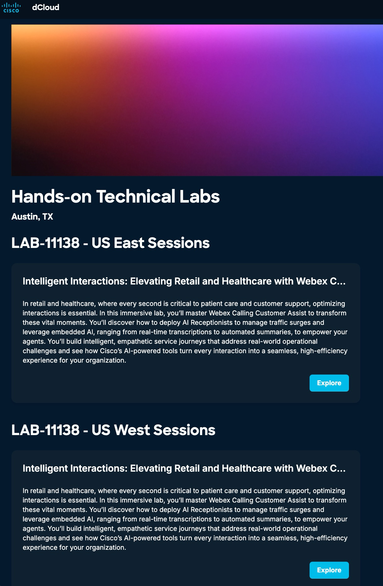
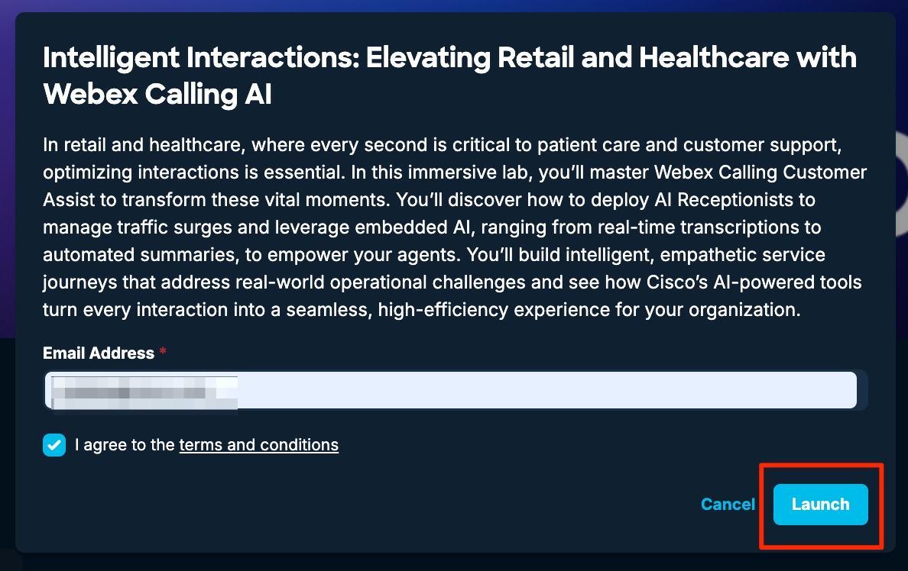
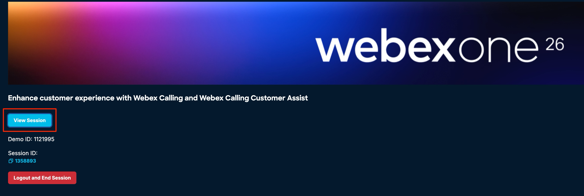
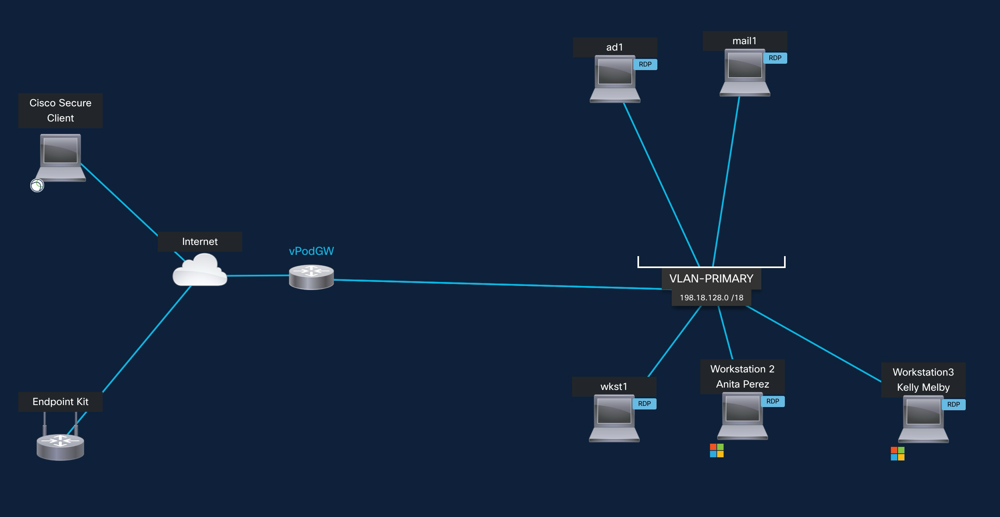
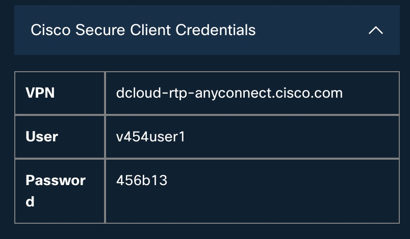
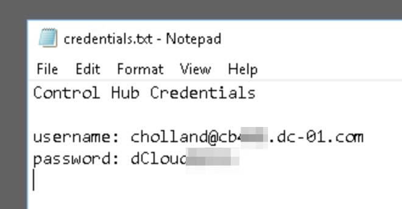
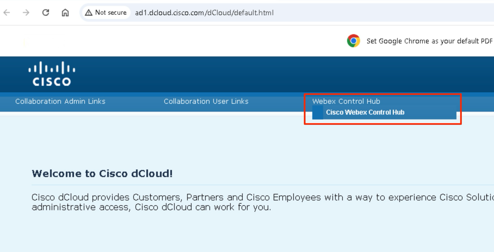
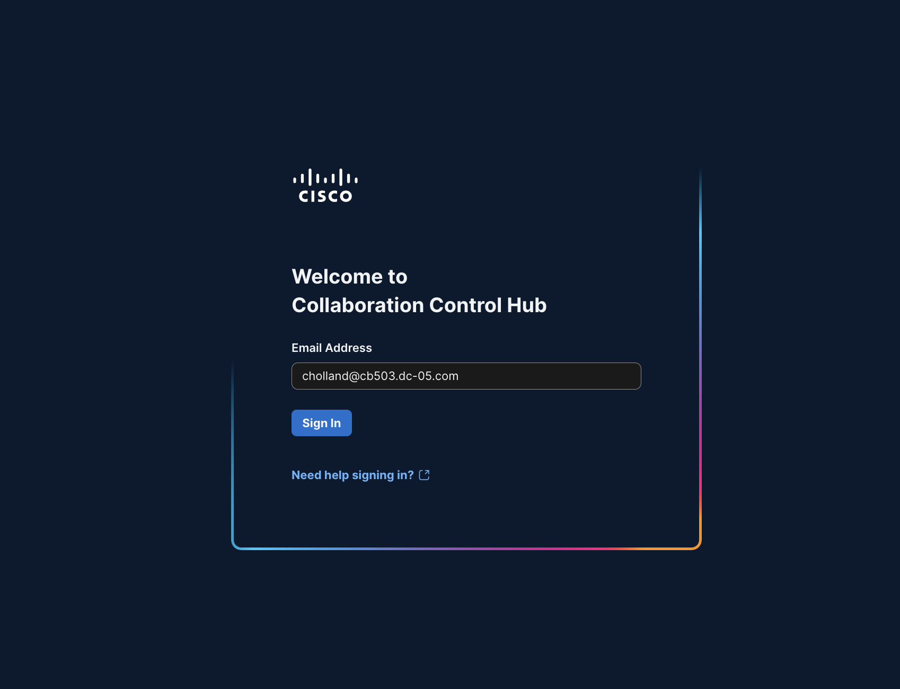
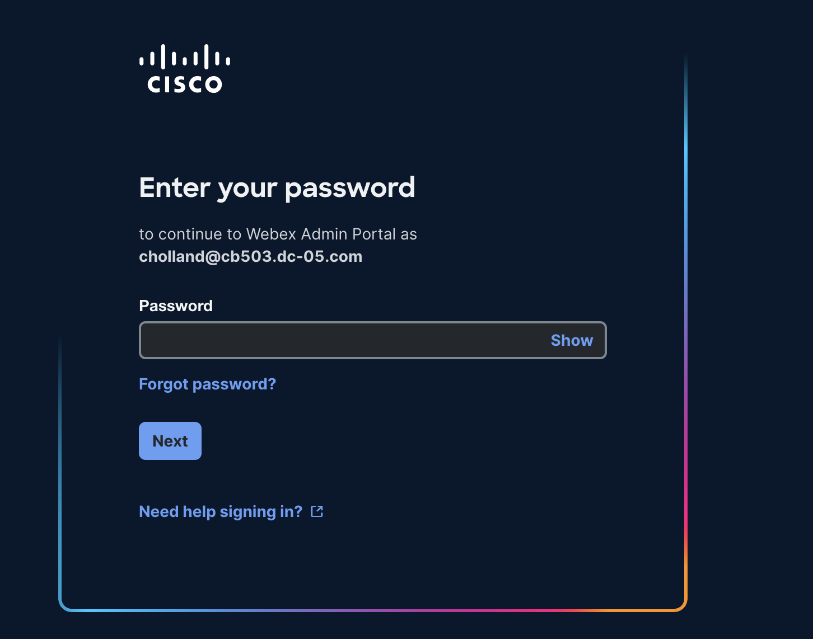
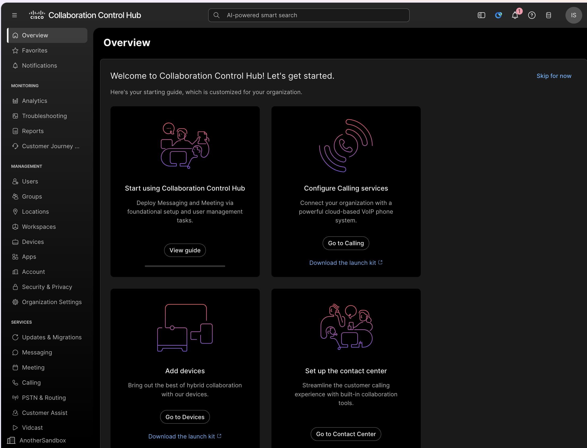

# Accessing the Lab

1. You should have the dCloud eXpo web page open in the web browser on your computer at desk. If not, click this <a href="https://www.ciscodcloud.com/apps/expo/58l9ebxbemfr7ykia2ib3phwy">link</a> to open the dCloud eXpo page and you should see this below page

2. Click ‘Explore’ next to either US West Sessions or US East Sessions.

3. You will then be asked to enter your email address, please enter your email address. Check the box to agree to terms &amp; conditions and then click “Launch”. (If you see an error, use the other Datacenter)

4. You will be automatically assigned to a lab pod, and you will see this page. Click “View Session”

5. And you will be taken to the Lab topology page as shown below.

6. Click on the wkst1 icon on the topology page and it will bring up a fly-out window on left with wkst1 related information like IP Address, username, and password as shown below.

7. Similarly, you can click on any other Virtual Machine on the topology page to get its respective details.

8. In this lab, you will access wkst1 (through WebRDP or Remote Desktop) and from wkst1 you will be able to access the Control Hub and the Webex app to complete the lab tasks. We will also use the other two Workstations for the Webex app in each of them for different users in the lab scenario.

9. There are two ways you can access Workstations. You can either connect via a local RDP connection (option A - preferred) connection or via a WebRDP connection (option B) from your classroom laptop.

Option (A) – [Preferred]

To connect to the Workstation using your local RDP connection, first, you need to connect to your lab session via VPN. Open Cisco AnyConnect/Cisco Secure Client client on your laptop. It will prompt you for the Host Address, username, and password information for your session.  You will find all these details under the Info &gt; Cisco Secure Client Credentials section of your lab.  Enter all the details as shown below and click OK to connect to your session.  The Host Address, username, and password will be different for each lab.  Use YOUR OWN assigned lab details.

Once you are connected to your lab session over VPN, you can open a local RDP connection on your laptop and connect to Workstation 1 using the following details:

Host: 198.18.1.36

Username: dcloud\cholland

Password: dCloud123!

Option (B)

To access Workstation 1 over WebRDP, click on the Workstation 1 icon on the topology page and when it brings up a fly-out window with workstation details.  On the fly-out window go to click on the Remote Access &gt; Web RDP.  It will open a new browser tab and connect you to Workstation 1.

10. On Workstation 1, Desktop there is text file named “credentials.txt”. This file has the credential information will be required throughout the lab modules.

Control Hub Username, Control Hub password.

Open this file and leave it open/minimized, so that it is easier to get this information when needed.

We will be using Workstation1 (wkst1), Workstation2 (wkst2) and Workstation 3 for our lab. We will be using the Webex app in the Workstations.

 

11. Open “Google Chrome” application on Workstation1.

12. From the home page, click “Webex Control Hub” and then click “Cisco Webex Control Hub”

13. The Collaboration Control Hub login page will appear.

14. We will use Charles Holland ‘s email address to login here. Charles is our Administrator for Control Hub. Credentials are in the Workstation 1 desktop in the file “credentials.txt”

 

15. Charles’s email address is in the format cholland@cbXXX.dc-YY.com.

16. In this page, enter the password for Charles.

17. You will then see the following page. This is the Collaboration Control Hub page; Control Hub is our Single-

pane of glass portal to manage all Webex services.

 

[Healthcare](healthcare.md){ .md-button .md-button--primary }

[Retail](retail.md){ .md-button }
