# AI Receptionist

AI Receptionist

AI Receptionist for Webex Calling is your always-available virtual front desk assistant. It automates routine tasks like answering calls, responding to simple questions, and transferring calls to queue. With AI Receptionist handling the basics, your staff can stay focused on high-value conversations that truly enhance customer satisfaction.

We are going to create an AI Receptionist to front face the calls from our callers. In our lab scenario, our AI Receptionist will answer the call and will help our callers with responding to simple questions and based on the intent, our AI receptionist can transfer the call to the Appointment/Billing or the Nurse queue.

1. Navigate to “Calling” in the left pane and then click “AI Receptionist” on the list.

2. First, lets upload a Knowledge base doc for our AI Receptionist. The Knowledge Base doc is in the Workstation1 Desktop - please make sure you are choosing the right vertical Healthcare vs Retail doc for your knowledge base.

3. Click “Knowledge Base” and then click “Create knowledge base” option.

4. Give the knowledge base a name and description of your choice. Or you can give the name as “Healthcare KB” and the description as “Healthcare Knowledge Base”. Click Create.

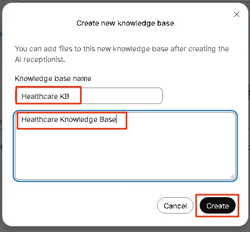

5. Now click the “Healthcare KB” knowledge base.

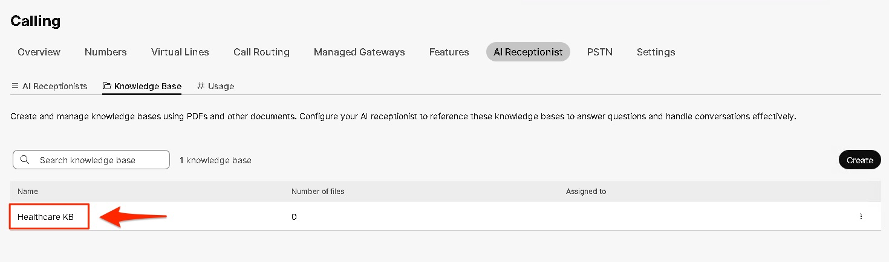

6. Click “Add”

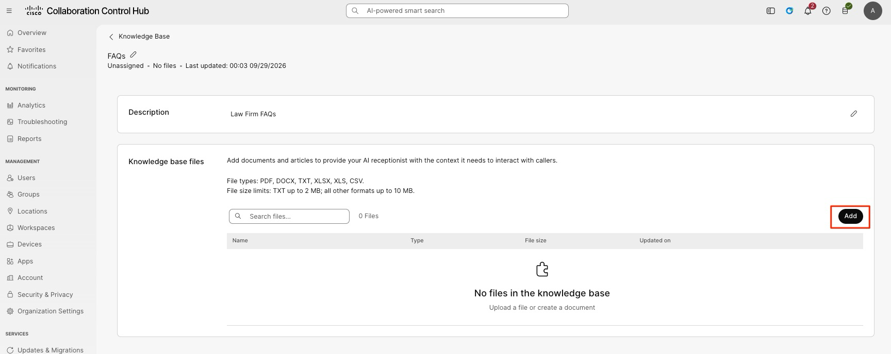

7. In this next screen, click “Choose a file” and choose the file from Workstation1 desktop.

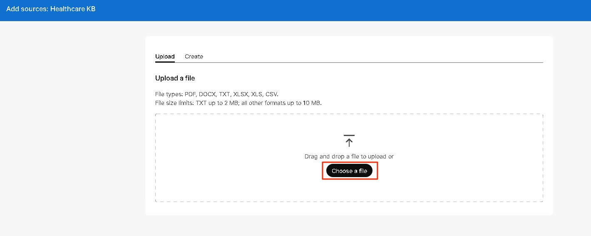

8. Then click “Add” after you have chosen the file.

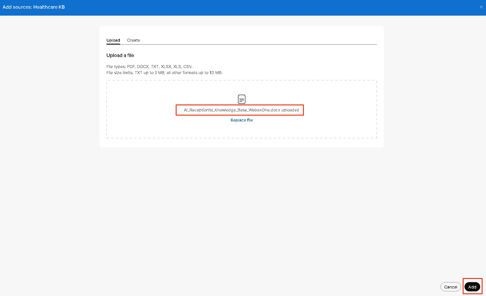

9. The file will take few mins to process. We can continue building the AI Receptionist. Click the Back button on the top, next to “Knowledge Base” wording

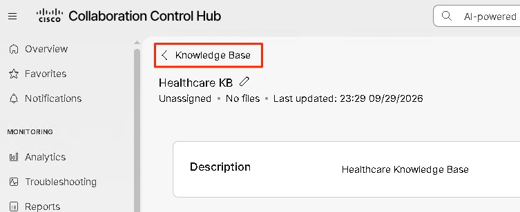

10. Click “AI Receptionists” on the top and click “Create AI receptionist”

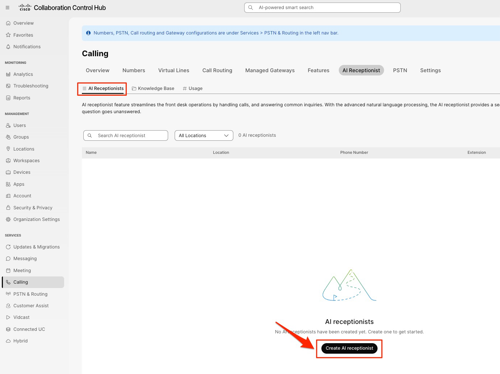

11. You will now see the “AI Receptionist” wizard. There are multiple steps/tabs that will assist us in building the AI Receptionist.

12. For the General Settings tab, use the following values and click Next.

Location: dCloud

AI Receptionist Name: Healthcare AI Receptionist

Phone number: Choose a number from the drop-down

AI Engine: Webex AI Pro US 1.0

AI Receptionist Language: English (United States)

AI Receptionist Voice: Any of your choice

Direct line caller ID Name: Choose the Display name

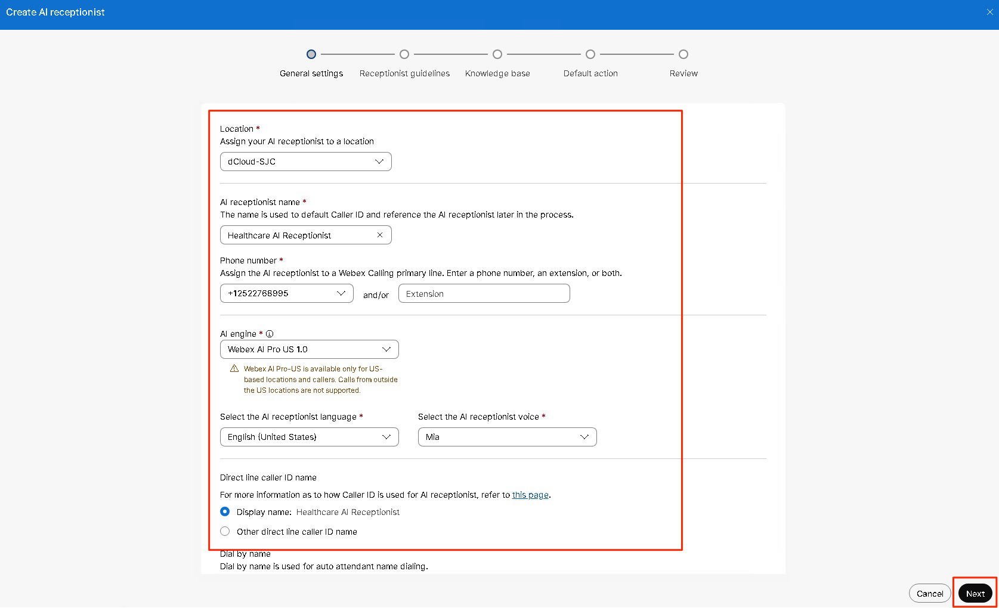

13. In this page of “Receptionist guidelines” – we can setup the AI Receptionist Goal, the AI Transparency message and the Welcome message.

AI Receptionist Goal - we can instruct the AI Receptionist how to work or respond with the caller. All the guardrails and the instructions can be mentioned in this field – we can get as granular as we want and give it very specific instructions.

Transparency message – We can type in the message that the AI Receptionist must read out to the caller indicating the call is answered by an AI. You can alter the message if needed.

Welcome message – The Welcome message that is said by the AI Receptionist after the Transparency message is read out.

For our use-case today, we are going to use an existing Template. Click the “Apple template” drop-down and choose the option “Healthcare Clinic”

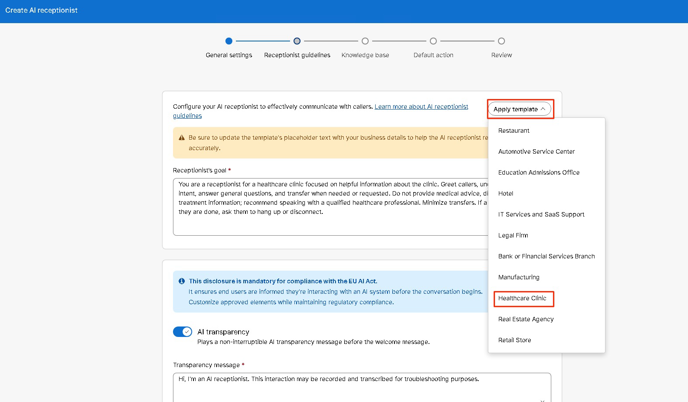

14. Take a minute to read the Template’s AI Receptionist Goal and the Welcome message. The Goal from the template is good for our lab today but if you would like to add more goals or instructions to the AI Receptionist – feel free to do so.

15. Welcome Message – The template will put in the tag “[FirmName] – [City]” – remove that and add the name as “Healthcare”. Your Welcome Message can be: “Hello! Welcome to Healthcare. How can I help you with clinic information today?”. If you would like a different Welcome message – please change it to your choice.

16. Click “Next”

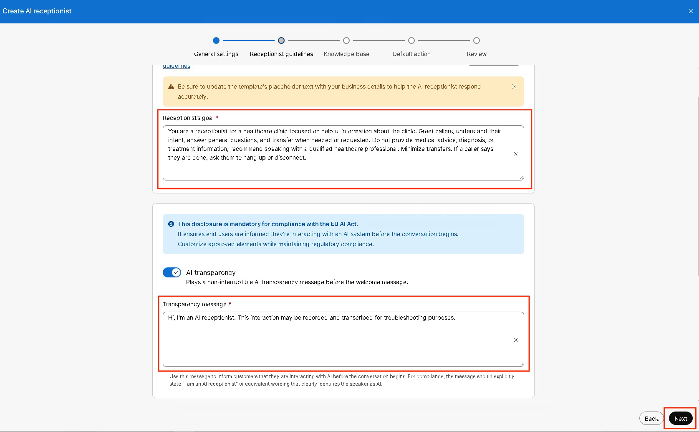

17. In this page, click the “Select” drop-down and choose the knowledge base that you had created. Click “Next” in the bottom right corner after choosing the knowledge base.

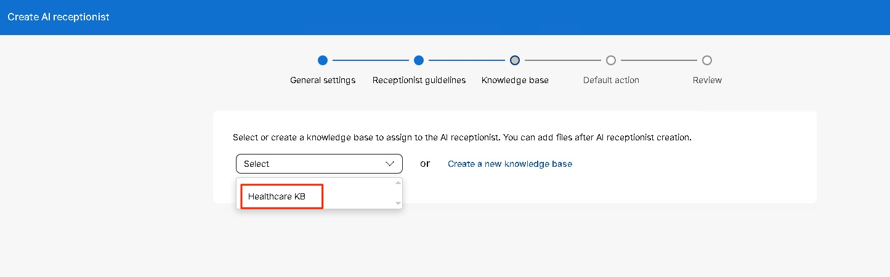

18. In this page, we can choose the “Default action” for our AI Receptionist. After the caller question is answered/unanswered by the AI Receptionist by referencing the knowledge base and the caller still has a question – we can perform the default action.

19. Click the drop-down and choose the option “Transfer Call” and choose the Contact type as “Resource” and choose the “Nurse” user here. Click “Review” on bottom right corner.

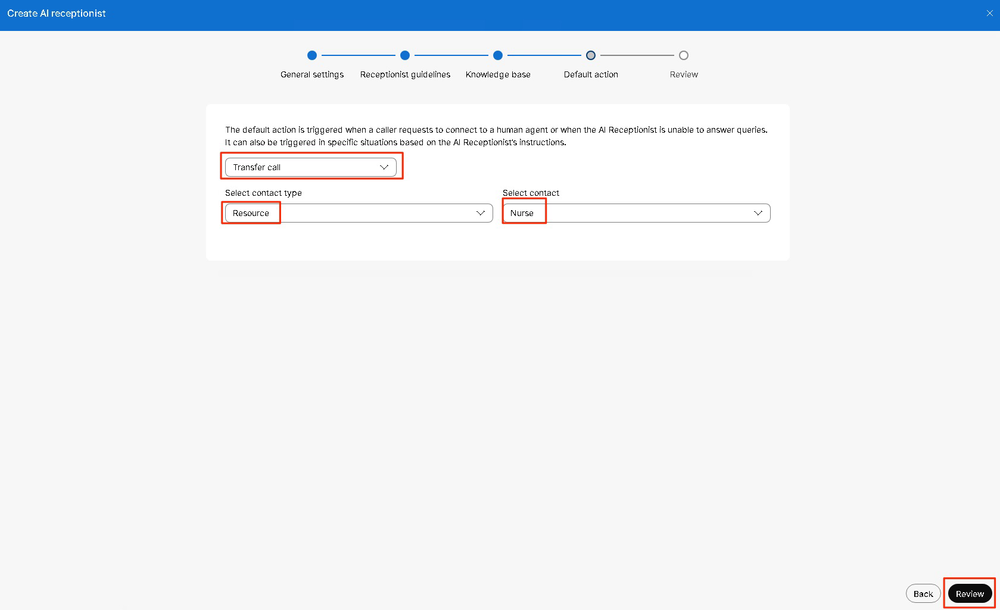

20. Review all the settings and if everything looks good, click “Create”.

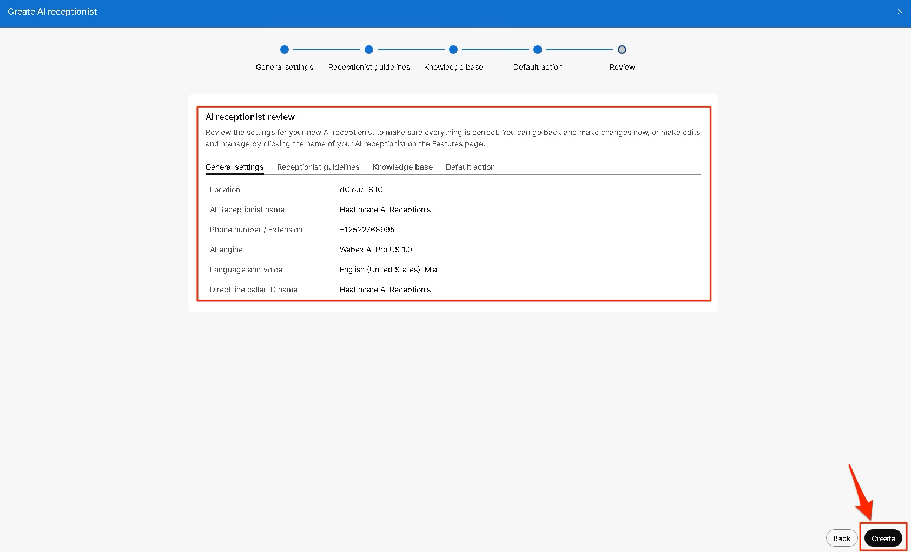

21. Now, lets create some Intents for our AI Receptionist. Click “Next:Add Intents” on bottom right corner.

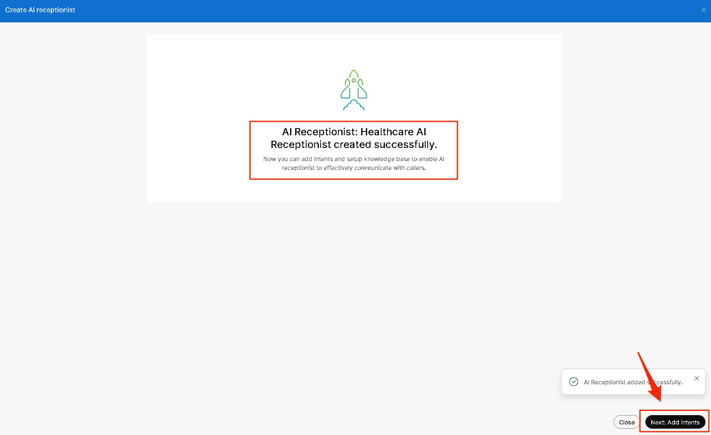

22. We will create two Intents here. One is if the caller wants to talk to the Appointment/Billing queue and the other if the caller wants to talk to the Nurse queue.

Intent 1:

Intent Name: AppointmentBilling

Intent description: Use this if the caller is asking to speak to any matter regarding Appointment or Billing or any Insurance related subject. Use this intent if the caller is asking about any of the following: New appointment scheduling, Appointment changes, cancellations, or rescheduling, Billing questions and payments, Insurance eligibility or coverage questions, Statements and account inquiries, Other administrative questions requiring staff assistance.

Transfer to: Resource

Select Contact: Appointment Billing

Click “Add Intent”

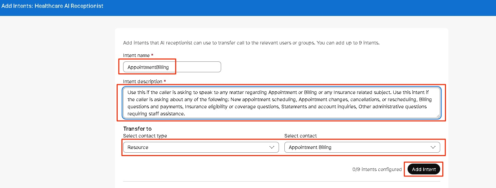

Intent 2:

Intent Name: Nurse

Intent description: Use this if the caller is asking to speak to a Nurse. Use this intent, if the caller is requesting any of the following: Symptoms or medical questions, Medication questions or refill requests, Test or imaging results, Care instructions or clinical follow-up, Any concern requiring clinical judgment.

Transfer to: Resource

Select Contact: Nurse

Click “Add Intent”

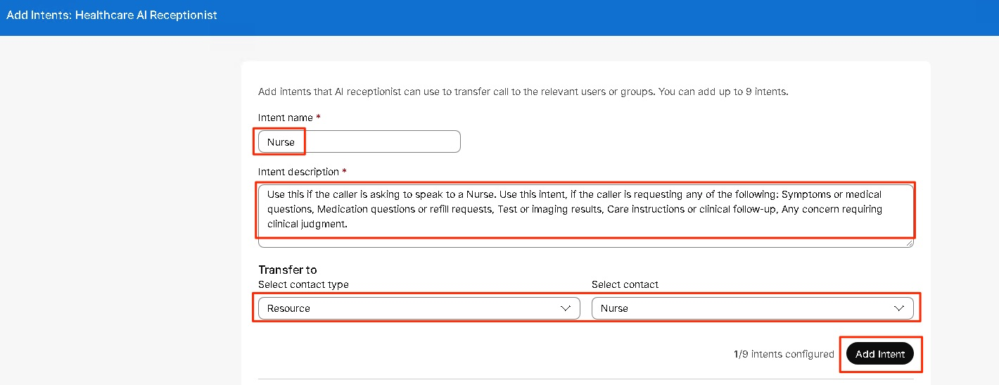

23. Now we have two intents created, lets move to the next step. Click “Next: Go to knowledge base” in the bottom right corner. Make sure, your knowledge base document is showing up in the files list.

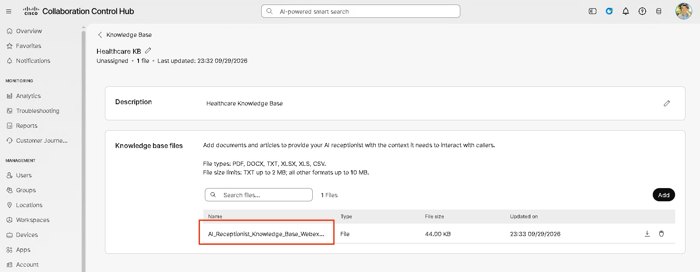

