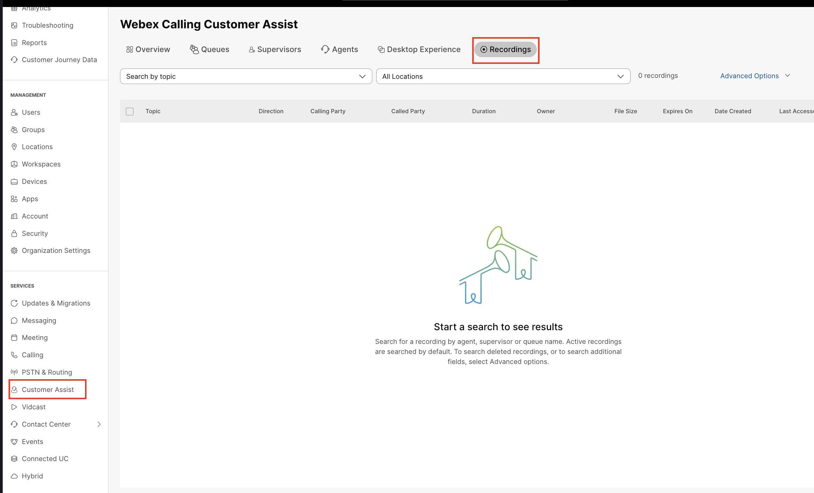
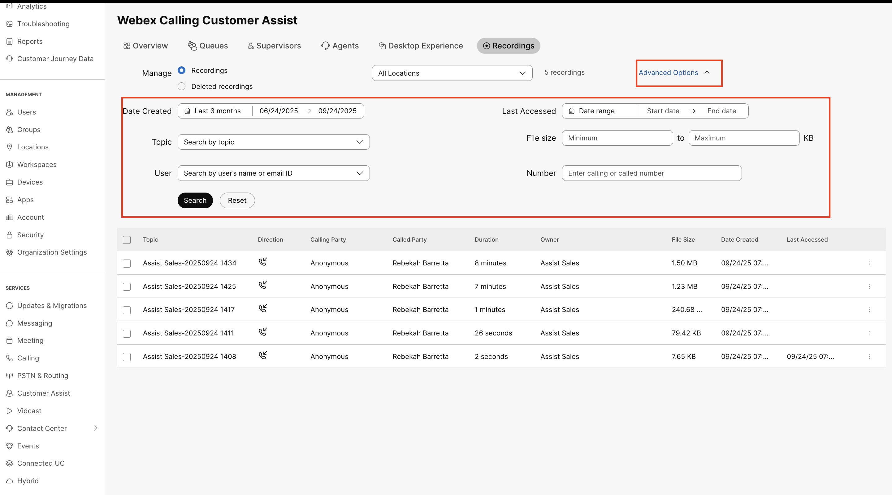
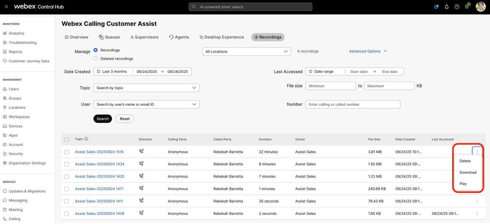

# Access Customer Assist Queue Recordings

153. In a browser, Log into Control Hub by going to admin.webex.com.

154. Log into Control Hub as Stefan Mauk (smauk@cbXXX.dc-YY.com/ password dCloudZZZZ!).  Refer to the Getting started section for the credentials.

155. Navigate to Services &gt; Customer Assist &gt; Recordings.

156. In the Advanced options, select your search criteria – make sure to include todays date –

157. On the recording and click the 3 dots at the end entry to access the recording playback controls

This now completes the testing of the Appointment Billing queue. Signout of the Webex app in Workstation 1 and Workstation 2.

 

