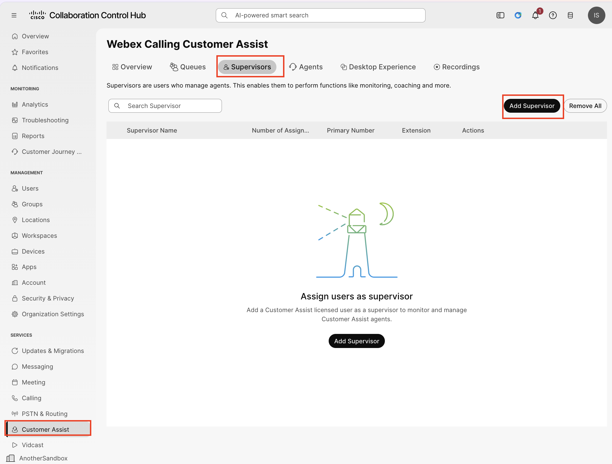
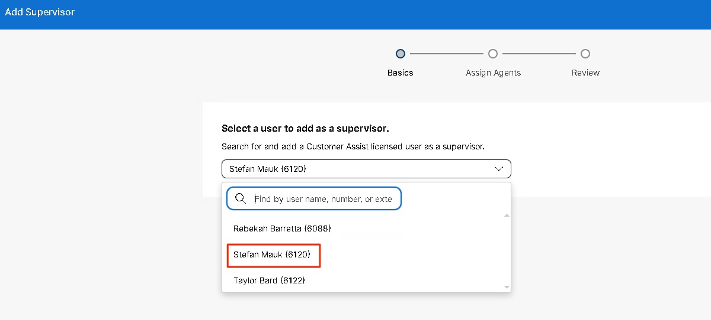
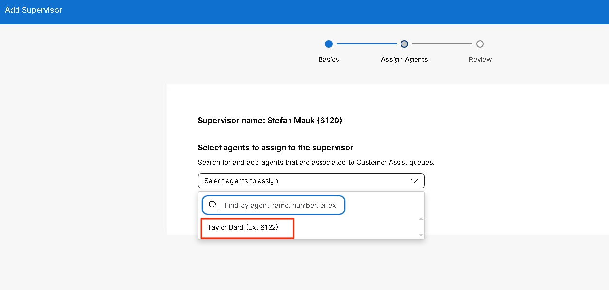
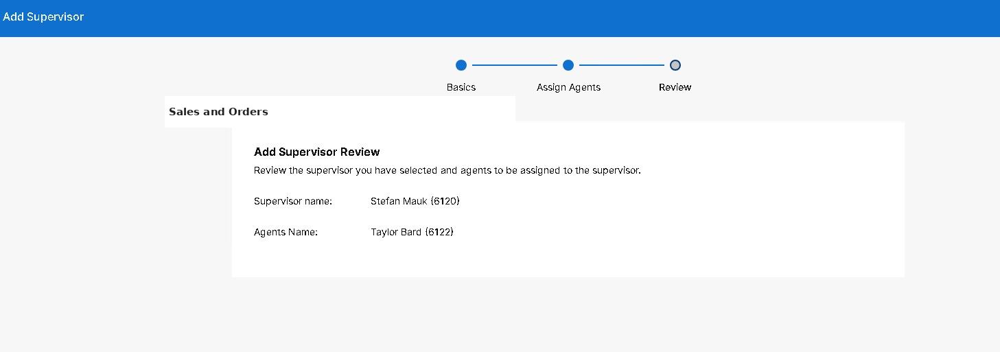

# Adding a Customer Assist Sales and Orders Queue Supervisor

53. Now add a supervisor. Click on the Supervisors tab and Select Add Supervisor.

54. Choose “Stefan Mauk” as the Supervisor and click on ‘Next’.

55. Choose ‘Taylor Bard’ as the agent to assign to the Supervisor.

 

56. Review and click Add Supervisor.

