# AI Receptionist

AI Receptionist

AI Receptionist for Webex Calling is your always-available virtual front desk assistant. It automates routine tasks like answering calls, responding to simple questions, and transferring calls to queue. With AI Receptionist handling the basics, your staff can stay focused on high-value conversations that truly enhance customer satisfaction.

We are going to create an AI Receptionist to front face the calls from our callers. In our lab scenario, our AI Receptionist will answer the call and will help our callers with responding to simple questions and based on the intent, our AI receptionist can transfer the call to the Sales and Orders or the Returns and Support queue.

24. Navigate to “Calling” in the left pane and then click “AI Receptionist” on the list.

25. First, lets upload a Knowledge base doc for our AI Receptionist. The Knowledge Base doc is in the Workstation1 Desktop - please make sure you are choosing the right vertical Healthcare vs Retail doc for your knowledge base.

26. Click “Knowledge Base” and then click “Create knowledge base” option.

27. Give the knowledge base a name and description of your choice. Or you can give the name as “Retail KB” and the description as “Retail Knowledge Base”. Click Create.

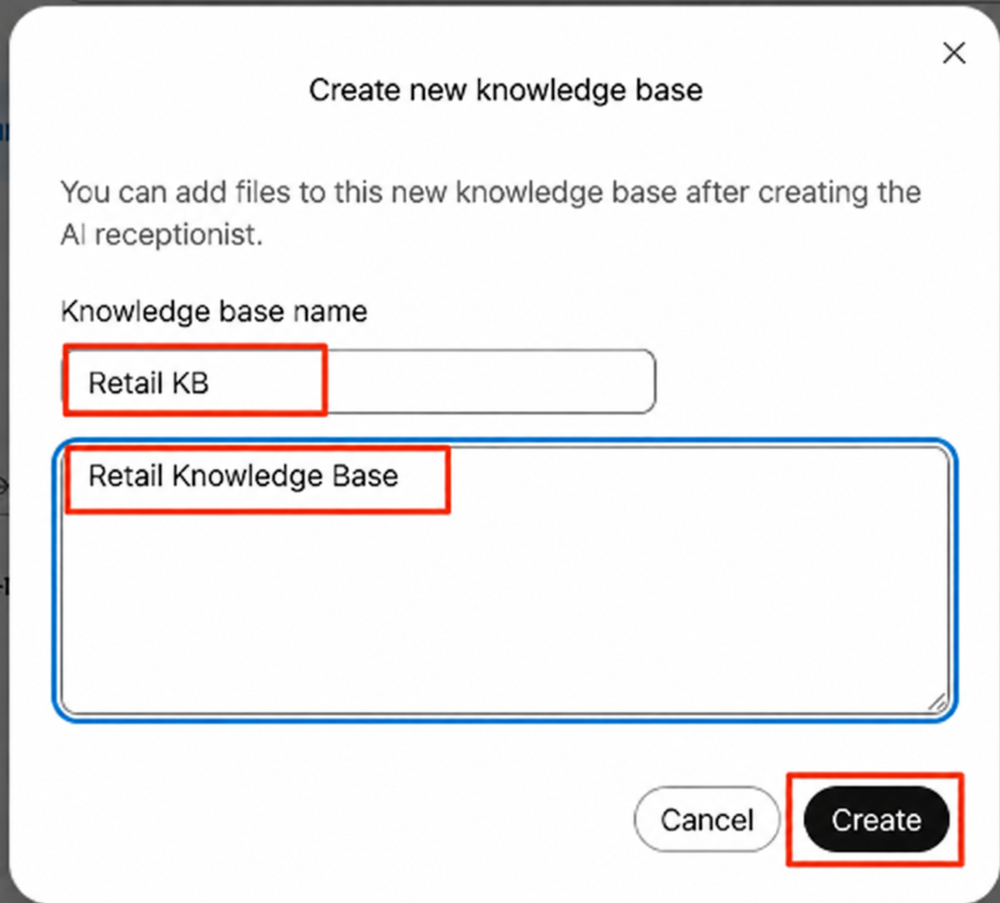

28. Now click the “Retail KB” knowledge base.

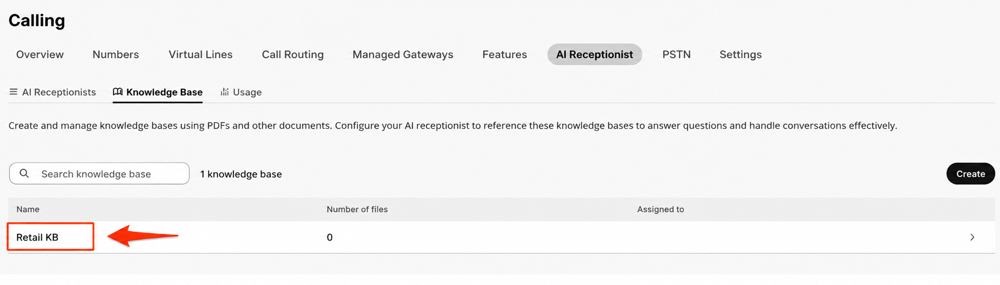

29. Click “Add”

30. In this next screen, click “Choose a file” and choose the correct KB file from the desktop.

31. Then click “Add” after you have chosen the file.

32. The file will take few mins to process. We can continue building the AI Receptionist. Click the Back button on the top, next to “Knowledge Base” wording

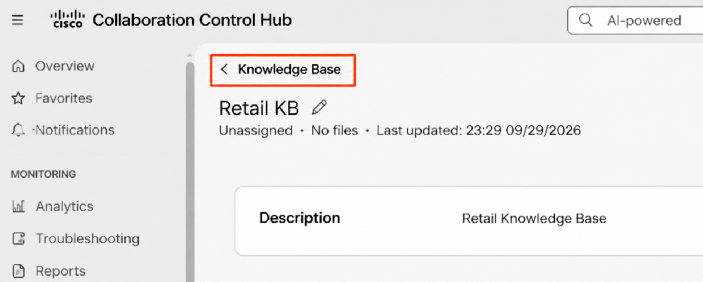

33. Click “AI Receptionists” on the top and click “Create AI receptionist”

34. You will now see the “AI Receptionist” wizard. There are multiple steps/tabs that will assist us in building the AI Receptionist.

35. For the General Settings tab, use the following values and click Next.

Location: dCloud-SJC

AI Receptionist Name: Retail AI Receptionist

Phone number: {{Choose a number from the drop-down}}

AI Engine: Webex AI Pro US 1.0

AI Receptionist Language: English (United States)

AI Receptionist Voice: {{Any of your choice}}

Direct line caller ID Name: {{Choose the Display name}}

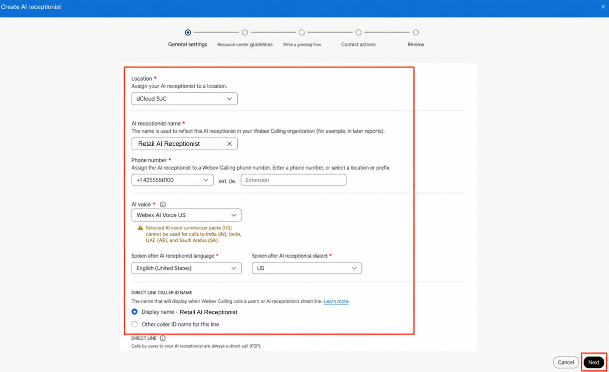

36. In this page of “Receptionist guidelines” – we can setup the AI Receptionist Goal, the AI Transparency message and the Welcome message.

AI Receptionist Goal - we can instruct the AI Receptionist how to work or respond with the caller. All the guardrails and the instructions can be mentioned in this field – we can get as granular as we want and give it very specific instructions.

Transparency message – We can type in the message that the AI Receptionist must read out to the caller indicating the call is answered by an AI. You can alter the message if needed.

Welcome message – The Welcome message that is said by the AI Receptionist after the Transparency message is read out.

For our use-case today, we are going to use an existing Template. Click the “Apple template” drop-down and choose the option “Retail Store”

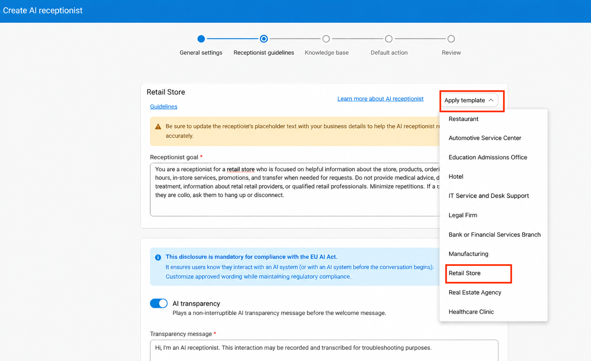

37. Take a minute to read the Template’s AI Receptionist Goal and the Welcome message. The Goal from the template is good for our lab today but if you would like to add more goals or instructions to the AI Receptionist – feel free to do so.

38. Welcome Message – The template will put in the tag “[FirmName] – [City]” – remove that and add the name as “Retail”. Your Welcome Message can be: “Hello! Welcome to Retail Store Support. How can I help you with store information, orders, or returns today?”. If you would like a different Welcome message – please change it to your choice.

39. Click “Next”

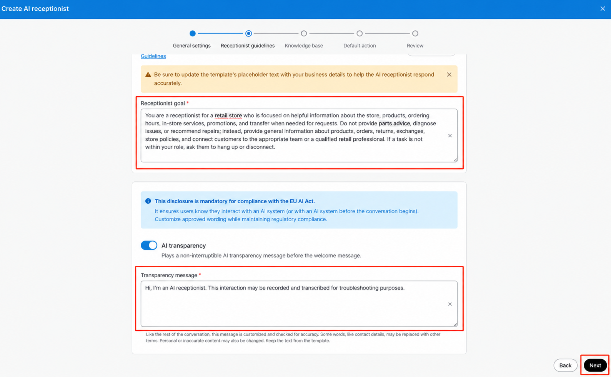

40. In this page, click the “Select” drop-down and choose the knowledge base that you had created. Click “Next” in the bottom right corner after choosing the knowledge base.

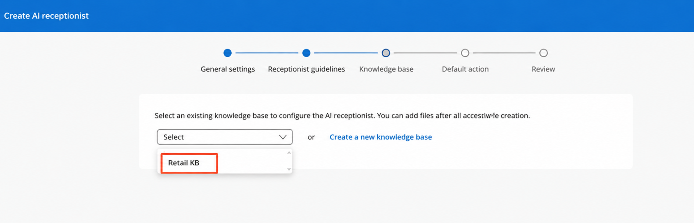

41. In this page, we can choose the “Default action” for our AI Receptionist. After the caller question is answered/unanswered by the AI Receptionist by referencing the knowledge base and the caller still has a question – we can perform the default action.

42. Click the drop-down and choose the option “Transfer Call” and choose the Contact type as “Resource” and choose the “Returns and Support” user here. Click “Review” on bottom right corner.

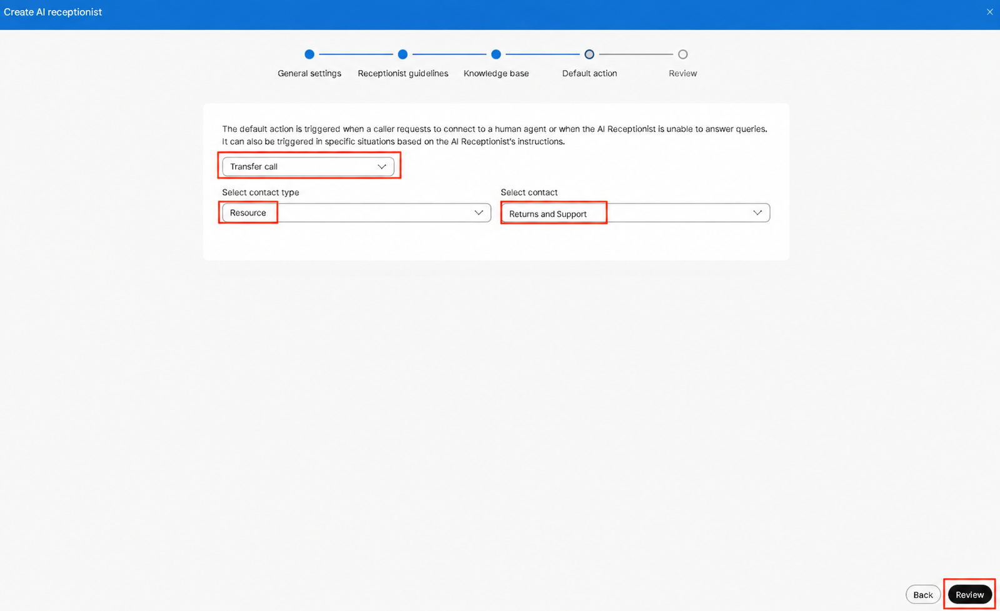

43. Review all the settings and if everything looks good, click “Create”.

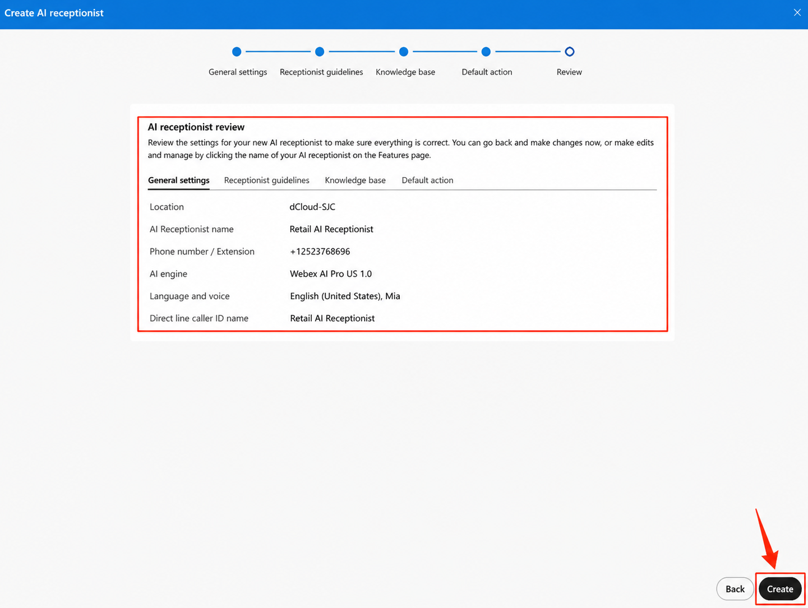

44. Now, lets create some Intents for our AI Receptionist. Click “Next:Add Intents” on bottom right corner.

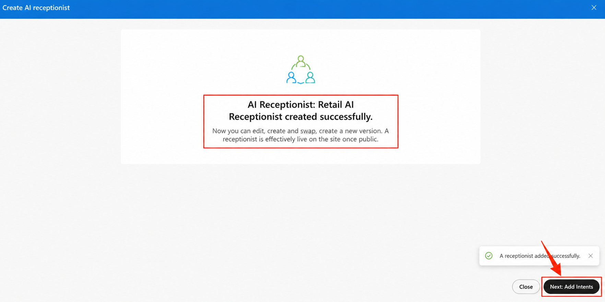

45. We will create two Intents here. One is if the caller wants to talk to the Sales and Orders queue and the other if the caller wants to talk to the Returns and Support queue.

Intent 1:

Intent Name: SalesOrders

Intent description: Use this intent if the caller is asking about purchasing products, placing an order, or getting assistance with an existing order. Use this intent if the caller is asking about any of the following:

• Product availability or pricing • Product information or recommendations • Placing a new order • Questions about an existing order • Order status or tracking • Changes or cancellations to an order • Shipping or delivery questions • Other sales or order-related questions requiring staff assistance

Select Contact type as Resource and select contact as Sales and Orders

Click “Add Intent”

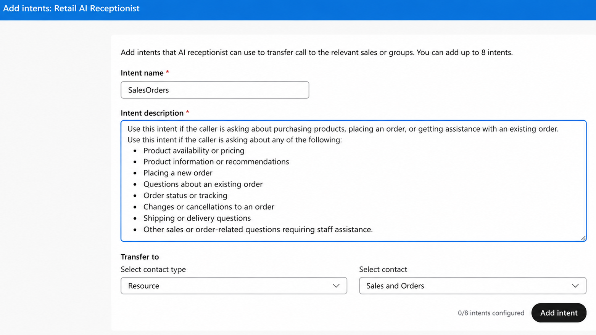

Intent 2:

Intent Name: ReturnsSupport

Intent description: Use this intent if the caller is asking for assistance with a return, refund, exchange, replacement, or product-related issue. Use this intent if the caller is asking about any of the following:

• Questions about returns or refunds • Exchange or replacement requests • Issues with a product, including damaged, defective, or non-working items • Warranty or product support questions • Order issues or missing items • Shipping or delivery problems • Other returns or support-related questions requiring staff assistance

Select Contact type as Resource and Select Contact: Returns and Support

Click “Add Intent”

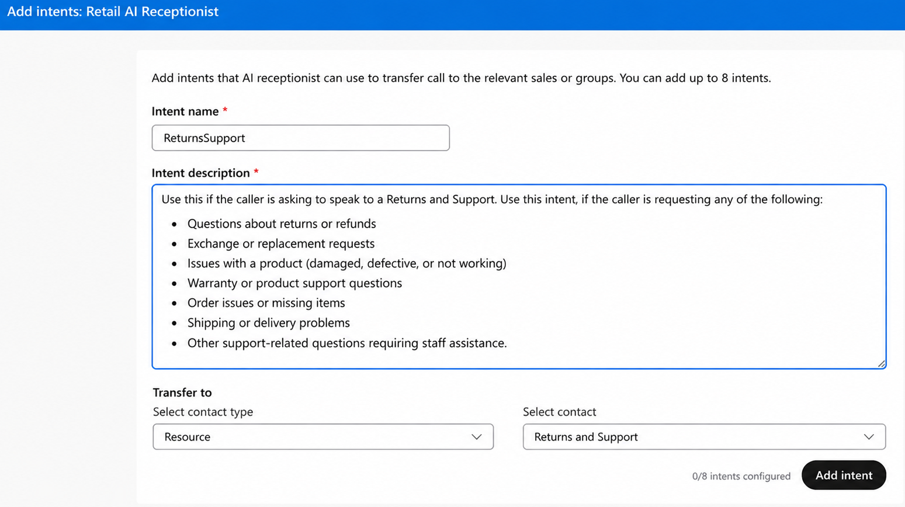

46. Now we have two intents created, lets move to the next step. Click “Next: Go to knowledge base” in the bottom right corner. Make sure, your knowledge base document is showing up in the files list.

