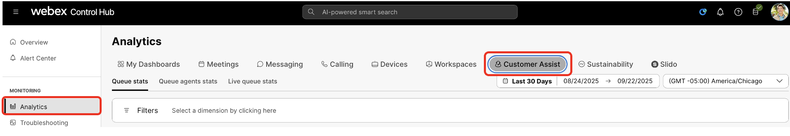
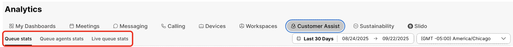
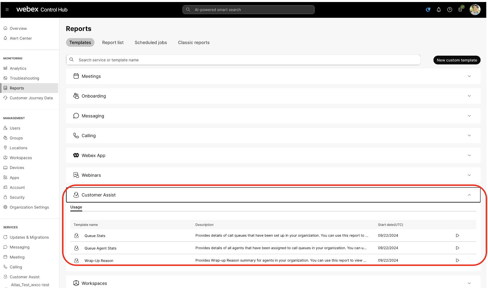
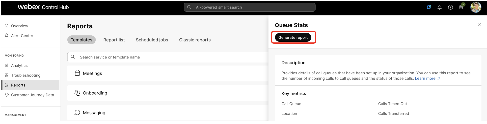
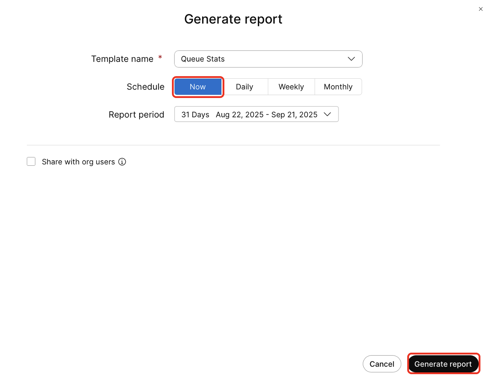
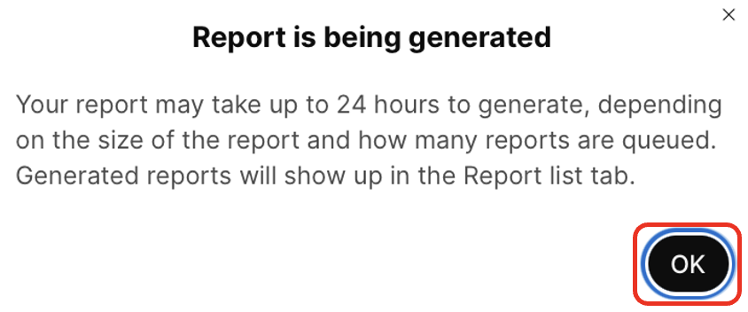
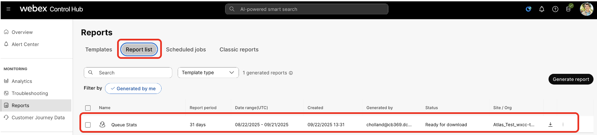

# Webex Calling Customer Assist Analytics and Reporting&#9;

In the previous section, you saw how the Agent and the Supervisor can look at the Analytics from the Customer Assist tab within the Webex app. In this section, you will see how you can get expanded Analytics and Reports from the Webex Control Hub.

308. In a browser, Log into Control Hub by going to admin.webex.com.

309. Log into Control Hub as Charles Holland (<a href="mailto:cholland@cbXXX.dc-YY.com">cholland@cbXXX.dc-YY.com</a>)Refer to the Getting started section for credentials.

310. Click on Analytics under Monitoring, then click Customer Assist.

311. There are three Customer Assist Call Queue Analytics pages.

• Queue Stats: There are call queue KPIs and stats such as Total answered, Total abandoned calls, Percentage of abandoned calls and Avg. wait time. Along with this, there are charts and trends for Incoming calls, Avg. Call queue time, Top Call queues and a detailed Call queue stats table.

• Queue Agent Stats: In this page, there are KPIs such as Total Answered, Total bounced calls and Avg. Handle Time. Along with this, there are charts and trends for Avg Agent call time, Incoming calls to Agents, Agents Handling time, Top Agents and a detailed Call queue agents table.

• Live Queue Stats: This page shows the Real time / Live stats for Active calls, Call Waiting, Held Calls and Live Call queue stats.

312. Explore the data in all 3 tabs

313. The analytics data can also be presented as reports, to access them click on Reports in the Monitoring section then select Templates.

314. Expand the Customer Assist section to see the available reports

• Queue Stats: Provides details of call queues that have been set up in your organization. You can use this report to see the number of incoming calls to call queues and the status of those calls.

• Queue Agent Stats: Provides details of all agents that have been assigned to call queues in your organization. You can use this report to see which agent gets the most calls and information about their calling stats

• Wrap-Up Reason: Provides Wrap-up Reason summary for agents in your organization. You can use this report to view Wrap-up Reason, Count and Wrap-up Durations for agents

315. Click on Queue Stats or Queue Agent Stats to see a flyout pane from the of right of the screen which will show you the Key Metrics that are included in the report.

316. Click “Generate report” to see the different options on how you can collect Report on-demand or even schedule jobs for Report collection.

317. From here you can set a schedule for the report to generate, for this lab you will run the report immediately so select Now and then Generate Report (you can leave the Report Period as the default.

 

318. You will see a pop-up informing you that the report is generating.  In a large organization this could take up to 24 hours but as there has not been much activity you should see the report withing a few minutes.  Click on OK.

319. Click on the Reports list tab and you should see the report listed and available for download.

Thank you for participating in the lab!

If you have any questions, you can ask your lab proctors now or reach out to them in the Webex space or Slido event.

If you're interested in exploring the features you configured today, we encourage you to:

• Visit the Expo floor to speak with our experts.

• Request a Webex Calling AI Receptionist and/or Customer Assist trial from your Cisco account team to test the features in your own environment.

