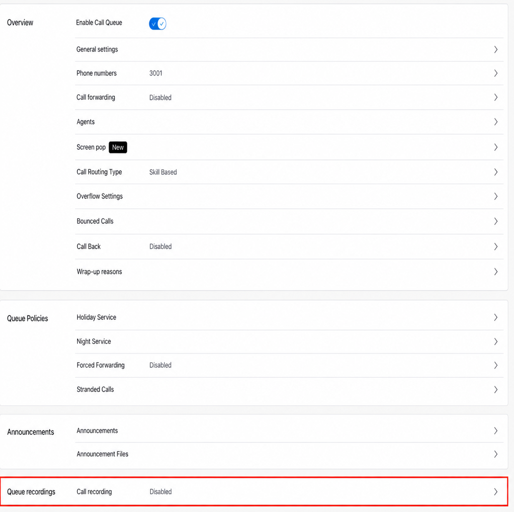
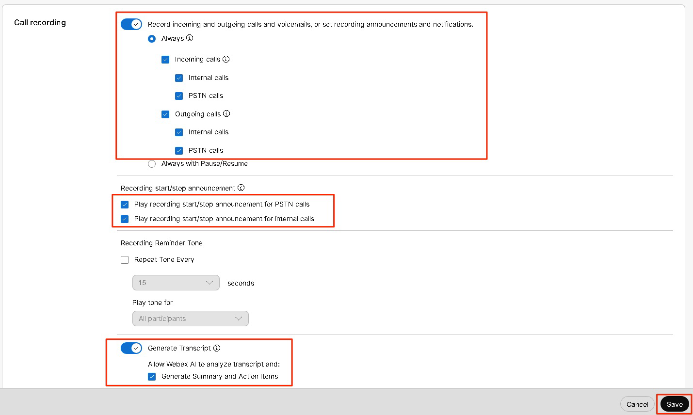

# Enable Recording for the Customer Assist Queue

Call recording allows you to record incoming and outgoing calls for your agents for the purpose of quality assurance, training, and compliance. You can configure different recording modes, including On-demand, Always, and Always with pause/resume, to suit your business needs and legal requirements.

203. Go back the queue overview scroll to the bottom and select Queue Recording.

 

204. Enter the Settings as shown in the table below and click Save.

<table markdown="1">
<tr><th markdown="span">Field</th><th markdown="span">Entry</th></tr>
<tr><td markdown="span">Record incoming and outgoing calls and voicemails or set recording announcements and notifications.</td><td markdown="span">{Enabled}</td></tr>
<tr><td markdown="span">Always</td><td markdown="span">{Enabled}</td></tr>
<tr><td markdown="span">Incoming calls</td><td markdown="span">{Enabled}</td></tr>
<tr><td markdown="span">Outgoing calls</td><td markdown="span">{Enabled}</td></tr>
<tr><td markdown="span">Play recording start/stop announcement for PSTN calls</td><td markdown="span">{Enabled}</td></tr>
<tr><td markdown="span">Play recording start/stop announcement for internal calls</td><td markdown="span">{Enabled}</td></tr>
<tr><td markdown="span">Generate Transcript</td><td markdown="span">{Enabled}</td></tr>
<tr><td markdown="span">Generate Summary and action items</td><td markdown="span">{Enabled}</td></tr>
</table>

 

