# Create the Returns and Support Queue

We will now create/setup the Returns and Support queue, this will also be a Customer Assist queue.

Returns and Support Queue description:

You want this queue to route calls to our Agents based on Agent’s Skill level. When an Agent answers the call, you want to show a Screen popup to the Agent with Customer information. If the Agents on this queue are busy or the Caller waits for more than 30 secs in the queue, then you want to overflow the calls from this queue to a Group Voicemail box which is accessible by the Agents. You want our Agents to be able to Join or Unjoin the queue as they deem to. Finally, you want to give our end customers the option for Call Back, just in case if they don’t want to wait in the queue and get a Callback from the Agent.

The agent and supervisor for this queue are

<table markdown="1">
<tr><th markdown="span">Username</th><th markdown="span">Email</th><th markdown="span">Role</th><th markdown="span">Queue Name</th><th markdown="span">Queue Type</th></tr>
<tr><td markdown="span">Rebekah Barretta</td><td markdown="span">rbarretta@cbXXX.dc-YY.com</td><td markdown="span">Agent</td><td markdown="span">Returns and Support</td><td markdown="span">Customer Assist</td></tr>
</table>

63. In the services section, select Customer Assist under Services, then Queues. Click Manage and Add. The Queue wizard will initiate.

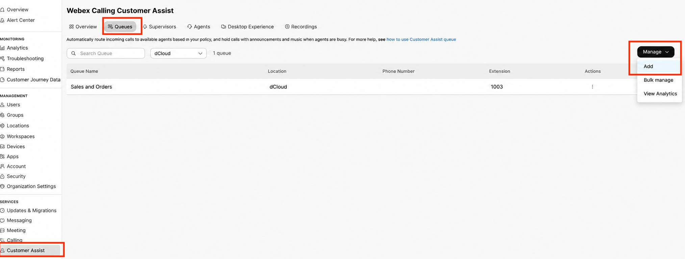

 

64. Enter the basic queue information as details in the following table, then click Next.

<table markdown="1">
<tr><th markdown="span">Field</th><th markdown="span">Entry</th></tr>
<tr><td markdown="span">Location</td><td markdown="span">dCloud-SJC(you might see dCloud-RTP, based on where your pod is hosted from)</td></tr>
<tr><td markdown="span">Queue Name</td><td markdown="span">Returns and Support</td></tr>
<tr><td markdown="span">Phone Number</td><td markdown="span">4001</td></tr>
<tr><td markdown="span">Number of calls in queue</td><td markdown="span">10</td></tr>
<tr><td markdown="span">Direct line Caller ID name</td><td markdown="span">Display Name</td></tr>
<tr><td markdown="span">External caller ID phone number</td><td markdown="span">{Select Location Number}</td></tr>
<tr><td markdown="span">Language</td><td markdown="span">English</td></tr>
</table>

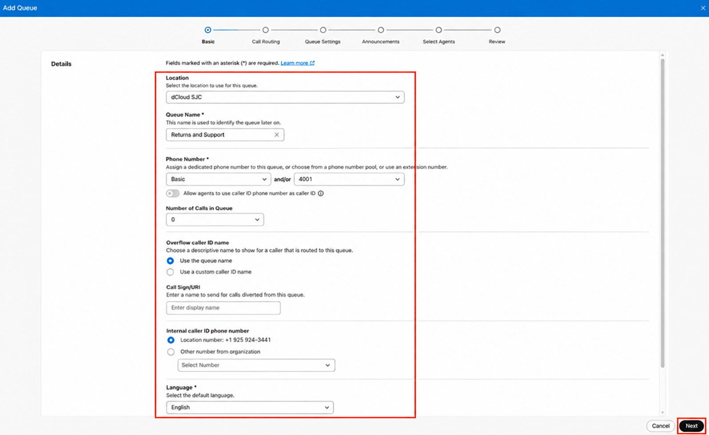

65. This queue will use Skills based routing and be configured for Longest Idle ring, Select the 2 options and click Next.

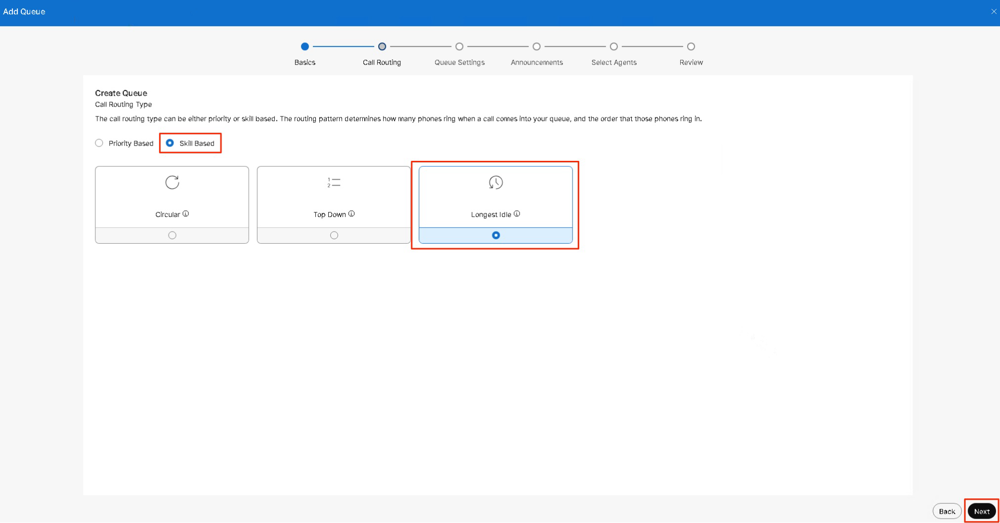

 

66. Enter the Settings as shown in the table below and click Next.

Screen pop is a Customer Assist Feature. Enabling this feature will open/pop up a screen with the URL and variable chosen. Enable the Slider and click ‘Add New’ under Query Parameters. For this lab, fill in the following data

<table markdown="1">
<tr><th markdown="span">Field</th><th markdown="span">Entry</th></tr>
<tr><td markdown="span">Screen Pop</td><td markdown="span">{Enable}</td></tr>
<tr><td markdown="span">Screen Pop URL</td><td markdown="span"><a href="https://www.truepeoplesearch.com/resultphone">https://www.truepeoplesearch.com/resultphone</a></td></tr>
<tr><td markdown="span">Screen Pop Desktop Label</td><td markdown="span">People Search</td></tr>
<tr><td markdown="span">Key 1</td><td markdown="span">Phoneno</td></tr>
<tr><td markdown="span">Value 1</td><td markdown="span">NewPhoneContact.ANI</td></tr>
</table>

With this, every time an Agent answering the call from the queue – they will see a screen pop automatically open and show a True people search on the Calling party number (ANI).  This is just an example, similarly you can setup the URL to your own application to open customer data based on various variables.

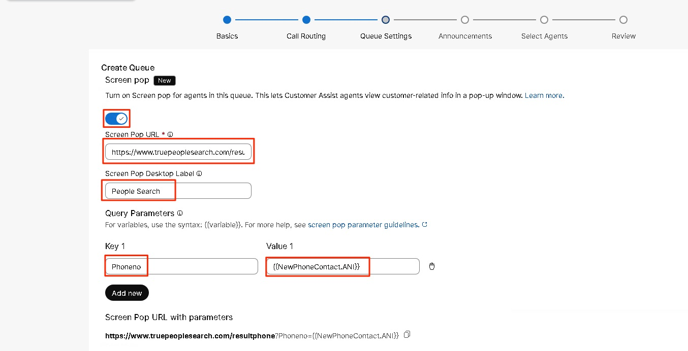

For the other settings, enter the below values

<table markdown="1">
<tr><th markdown="span">Field</th><th markdown="span">Entry</th></tr>
<tr><td markdown="span">For new calls when the queue is full (Overflow)</td><td markdown="span">{Transfer to phone number}</td></tr>
<tr><td markdown="span">Phone Number</td><td markdown="span">4003 (this Voicemail box is pre-created)</td></tr>
<tr><td markdown="span">Send to voicemail</td><td markdown="span">{Disabled}</td></tr>
<tr><td markdown="span">Enable overflow after calls wait x seconds</td><td markdown="span">{Enabled}</td></tr>
<tr><td markdown="span">Seconds</td><td markdown="span">30</td></tr>
<tr><td markdown="span">Play announcement before overflow processing</td><td markdown="span">{Disabled}</td></tr>
<tr><td markdown="span">Notification tones for agents </td><td markdown="span">Use organization’s default settings</td></tr>
</table>

You might see the new “Auto Answer” settings in this page, read through it but we will not be using the feature for our today.

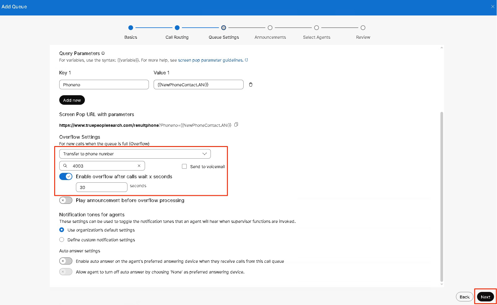

 

67. We are now in the Announcements page. We will be building an AI Receptionist in the later part of the lab, which front faces the calls from PSTN. So we do not need another Welcome Message for this queue, we can leave the Welcome Message option disabled in this page. 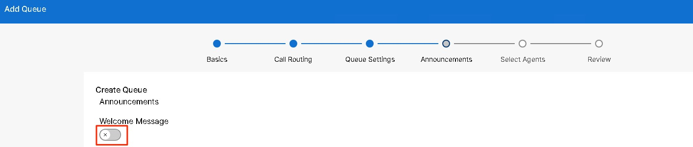

68. Estimated wait message for Queued calls: Enable this slider and set a default Call Handling type. Based on the default Call Handling Time and the number of Agents logged-in/available, Webex Calling will automatically calculate the Estimated Wait Time. You can then choose to play the Queue position or the Wait time to the Caller. Also, there is an option to play high volume message.

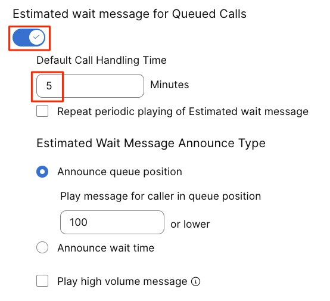

 

69. Comfort Message: Enable this slider/option to play any Comfort message. This can be any promotion messages or info about product and services. There is an option to enter the time between comfort messages, and an option select default or custom greeting.

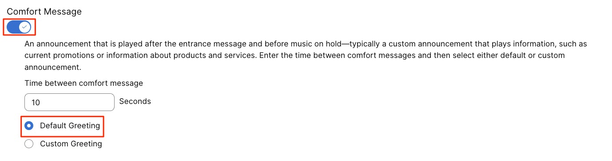

70. Comfort Message Bypass: Enable this option to bypass the comfort message if the wait time is less than ‘X’ seconds. Choose Default Greeting.

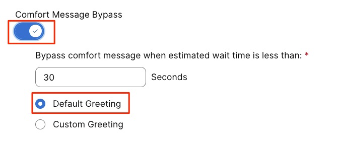

71. Hold Music: As the name implies, this is the call queue’s Music on hold.

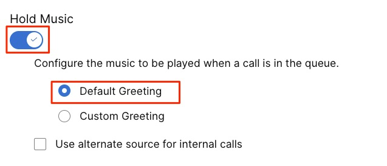

72. Call whisper: Enable this option for the Agent answering queue call to hear a short whisper message to identify the queue. This is useful for the Agent to identify the queue. if they are logged in to multiple call queues and working on all of them.

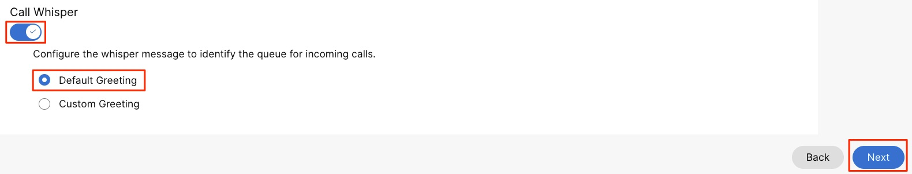

 

73. Once you have chosen the options as shown in the above screenshots, please click ‘Next’ on bottom right corner.

74. Now we need to assign Rebekah Barretta as an agent in this queue.  Enable Show Customer Assist users only toggle to just filter the Customer Assist licensed users. Click on the Search users to add to queue  drop-down and select Rebekah. You can change the skill level from a range of 1 (Highest skilled agent) to 20 (lowest skilled agent).  For this queue, Rebekah is the highest skilled agent so keep the skill level as 1. 

Enable allow agents to join or unjoin the queue, then click Next.

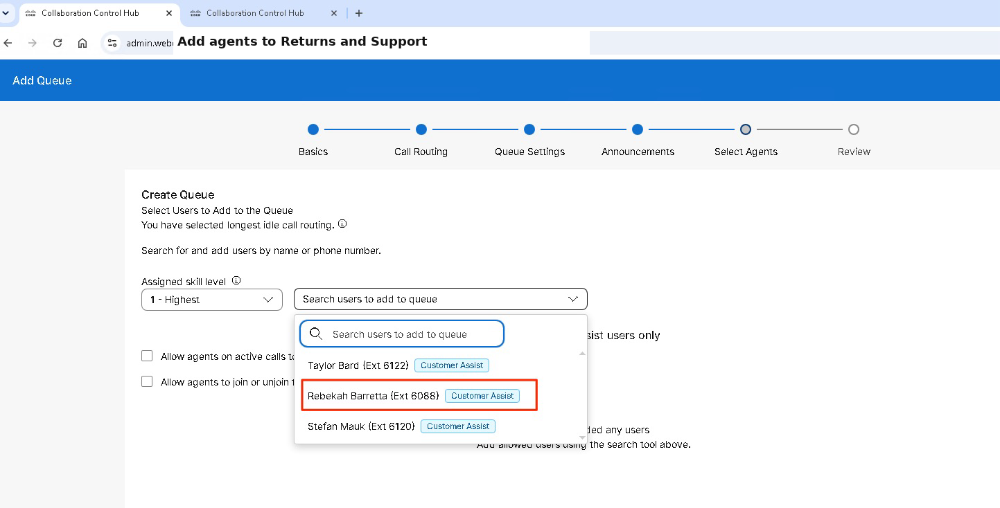

 

75. Review your work and when you are happy with the configuration, click Create.

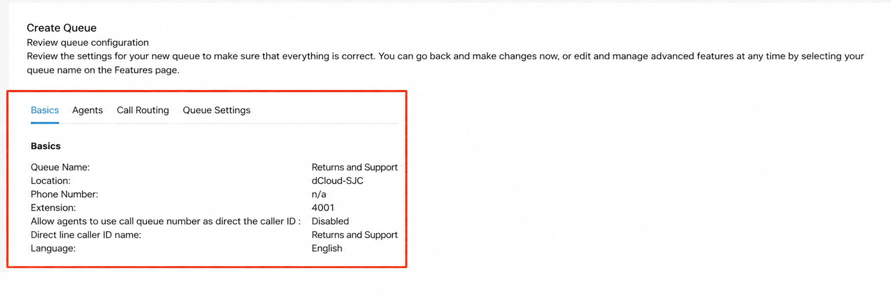

76. Success! Click Done.

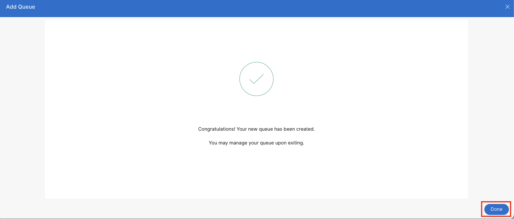

77. You need to configure some additional queue settings. Click on your newly created Returns and Support queue to set the options.

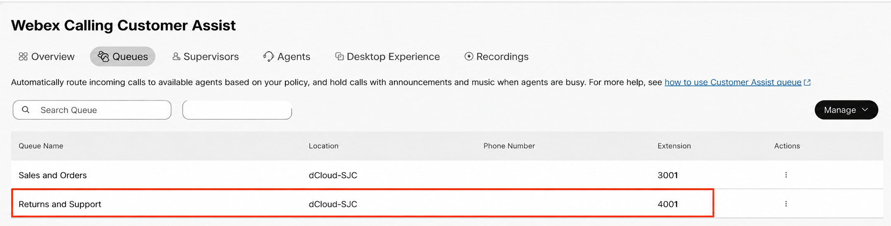

 

Bounced Call

78. In the queue overview window, click Bounced Calls.

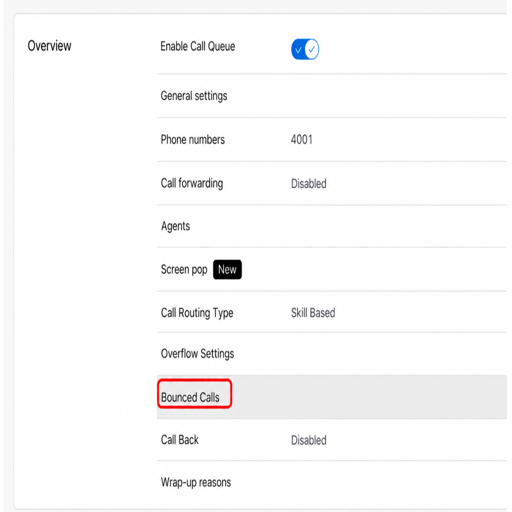

79. Enable the Bounce calls after set number of rings and set the rings to 8

80. Enable Bounce calls if an agent becomes unavailable

81. Enable Alert agent if call on hold for a set wait time and set the timer to 30 seconds. Click Save.

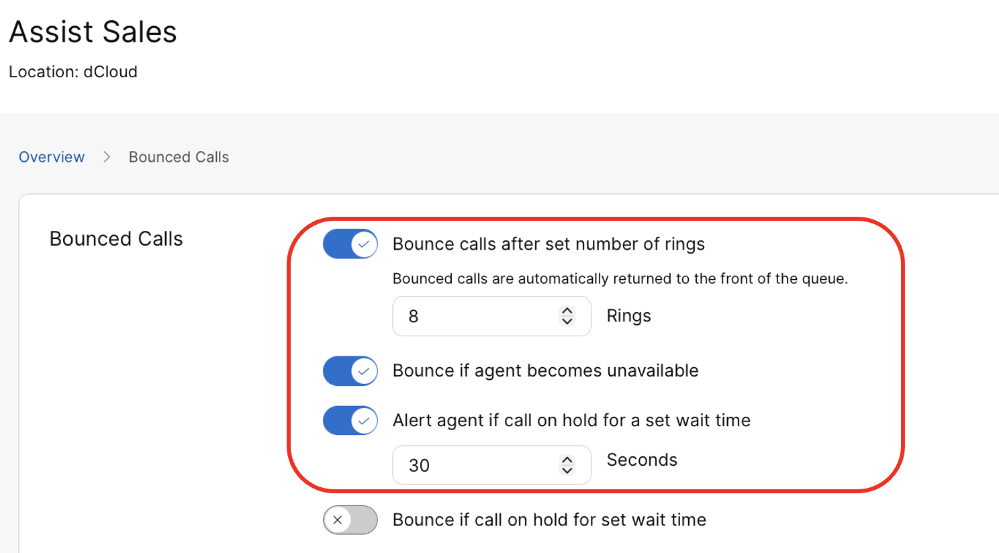

 

Stranded Call

Stranded calls are calls that are left in a call queue when all agents assigned to the queue have signed out or are unavailable. Webex Calling gives us options on how we can handle calls that end up stranded

82. Go back the queue overview and select Stranded call settings from the queue policies section.

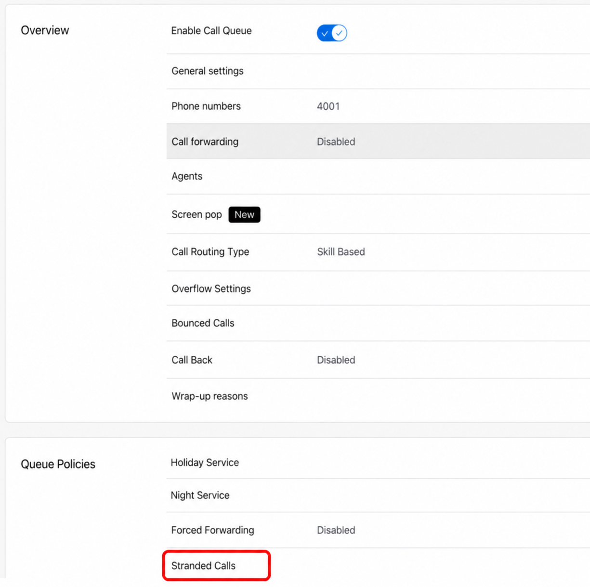

83. Enable the Trigger policy when all agents are unreachable.

84. Set the What to do with stranded calls option to Transfer to Phone Number and enter extension 4003 (the Voicemail box that is pre-created). Click Save

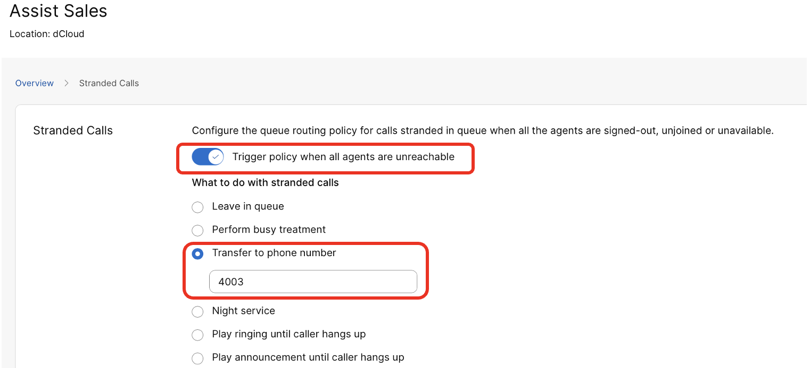

Night Service

When night service is Enabled, the call queue will route calls differently during the hours when the queue is not in service.

85. Go back to the Overview window and choose Night Service under Queue policies.

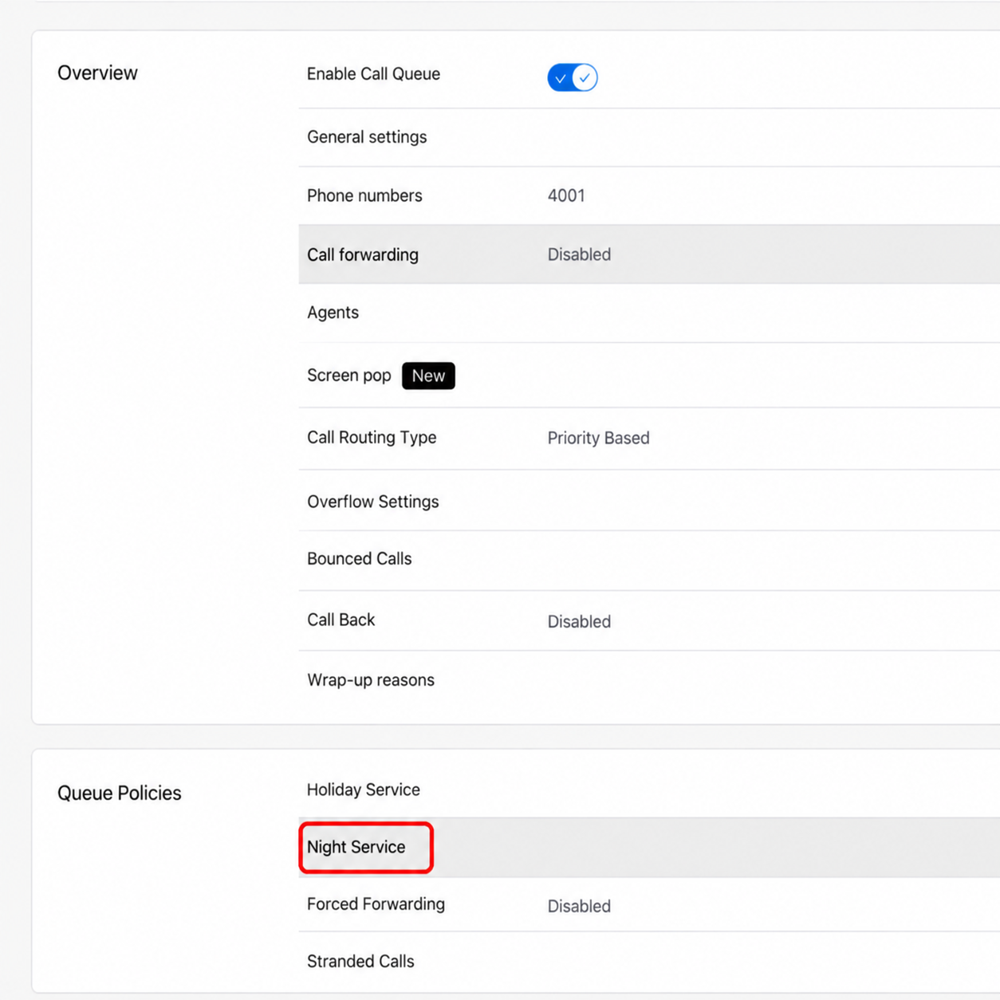

86. Enable night service and set the option Transfer to phone number and enter 4003 as the target number.

87. Set the Business Hours to WxOne

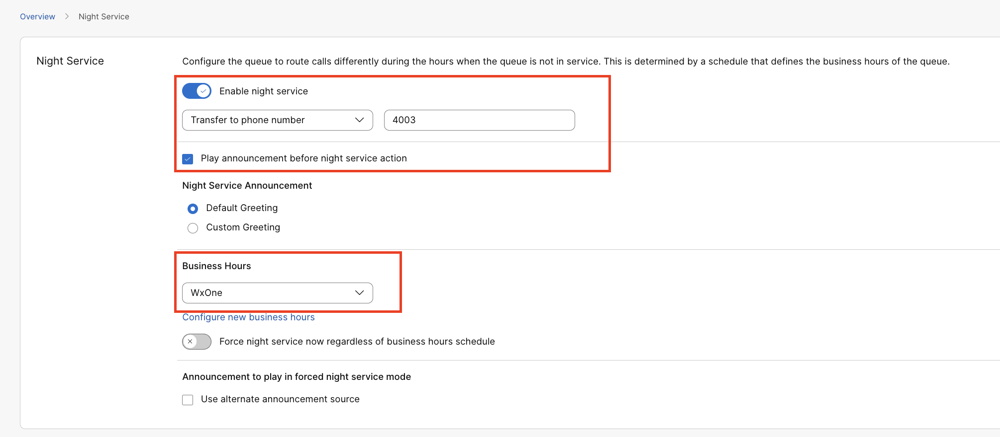

Callback

88. Click in the Call queue name (Assist Support) and click “Callback” as shown in the below screenshot

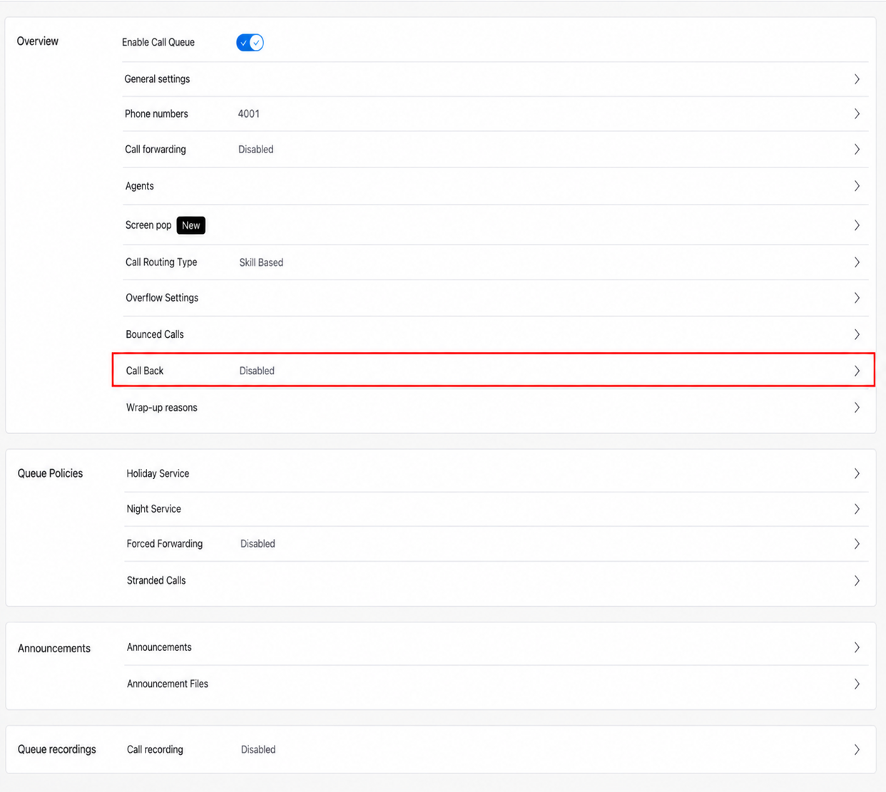

89. Enable the slider for Callback functionality. You can also choose the minimum estimated time for the call back option. For this lab, you will leave it as 30 mins (default) and then click Save.

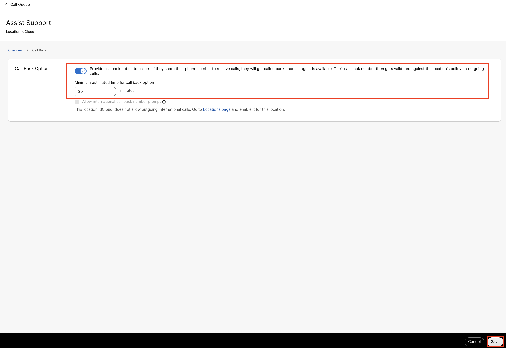

 

### Enable Recording for the Customer Assist Returns and Support Queue

Call recording allows you to record incoming and outgoing calls for your agents for the purpose of quality assurance, training, and compliance. You can configure different recording modes, including On-demand, Always, and Always with pause/resume, to suit your business needs and legal requirements.

90. Go back the queue overview scroll to the bottom and select Queue Recording.

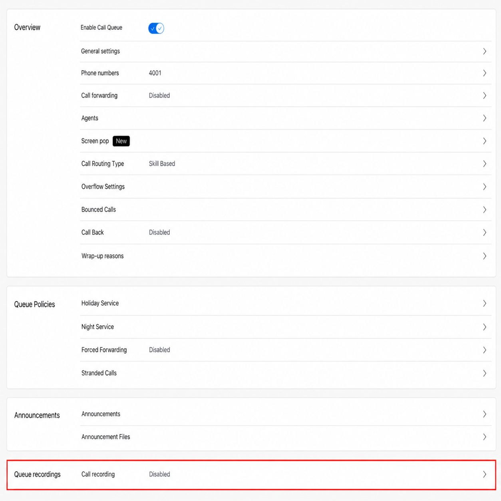

 

91. Enter the Settings as shown in the table below and click Save.

<table markdown="1">
<tr><th markdown="span">Field</th><th markdown="span">Entry</th></tr>
<tr><td markdown="span">Record incoming and outgoing calls and voicemails or set recording announcements and notifications.</td><td markdown="span">{Enabled}</td></tr>
<tr><td markdown="span">Always</td><td markdown="span">{Enabled}</td></tr>
<tr><td markdown="span">Incoming calls</td><td markdown="span">{Enabled}</td></tr>
<tr><td markdown="span">Outgoing calls</td><td markdown="span">{Enabled}</td></tr>
<tr><td markdown="span">Play recording start/stop announcement for PSTN calls</td><td markdown="span">{Enabled}</td></tr>
<tr><td markdown="span">Play recording start/stop announcement for internal calls</td><td markdown="span">{Enabled}</td></tr>
<tr><td markdown="span">Generate Transcript</td><td markdown="span">{Enabled}</td></tr>
<tr><td markdown="span">Generate Summary and action items</td><td markdown="span">{Enabled}</td></tr>
</table>

 

### Wrap-up reason and wrap-up timer for the Returns and Support Queue

We will use the below Wrap-up reasons for the Agent(s) to select for the Returns and Support queue

• Return and Refund Request

• Exchange / Replacement

92. Go to Services &gt; Customer Assist &gt; Desktop Experience. You will see the previously created Wrap-up reasons from Sales and Orders queue. Click on Manage drop-down and click Add Wrap-up reason

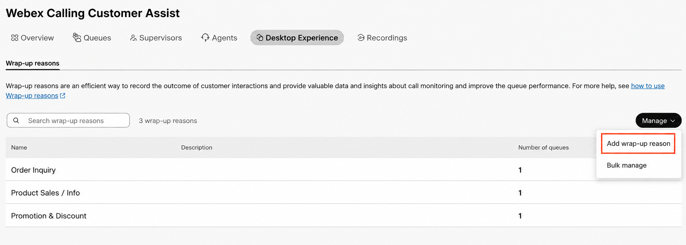

93. On the Add wrap-up reason page, Create the Wrap up reason Return and Refund Request then select Specific queue followed by the Returns and Support Queue.  Click Create.

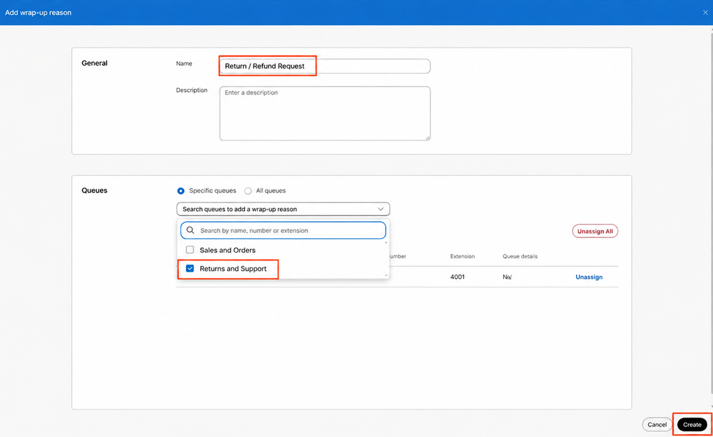

94. You will be taken back to the Wrap-up Reasons page.  Click Manage followed by Add Wrap-up Reason.

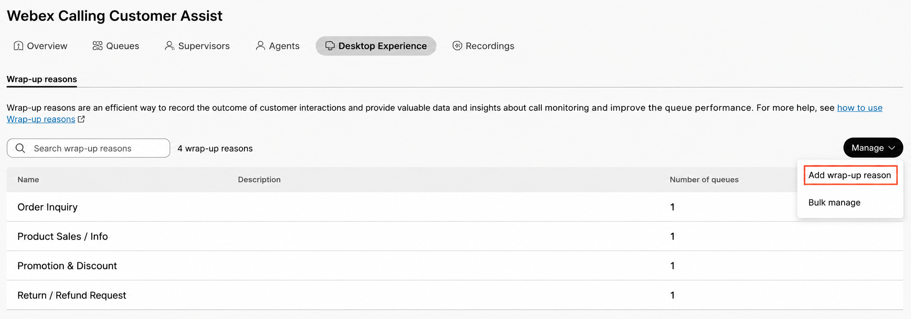

95. Add 1 more wrap up reason, Exchange / Replacement like how you added the first one

96. Next to Set a default wrap-up time for the support queue- Under the Services section on the left panel select Customer Assist &gt; Queues and select the Returns and Support Queue as shown in the screenshot below

97. Go to Overview section and click Wrap-up reasons.

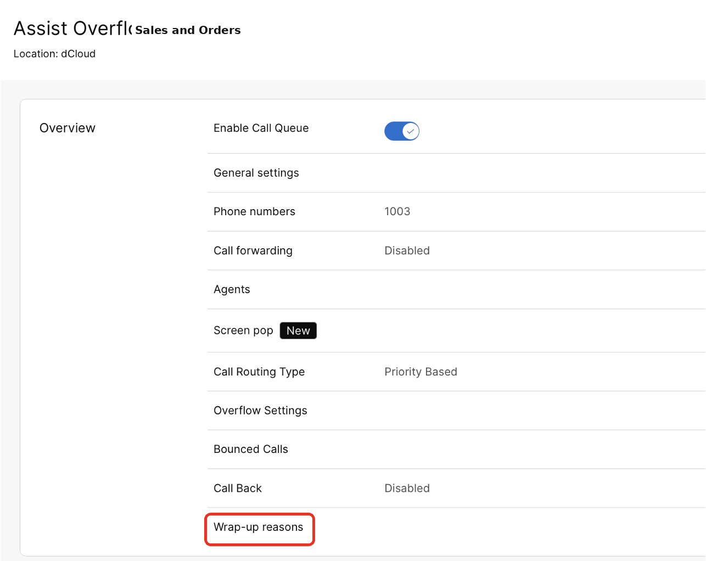

98. From here you can see the assigned wrap-up reasons and the default option (in this example, Return and Refund Request). Enable the Wrap-up timer and the timer to 120 (2 minute) and then click on Save.

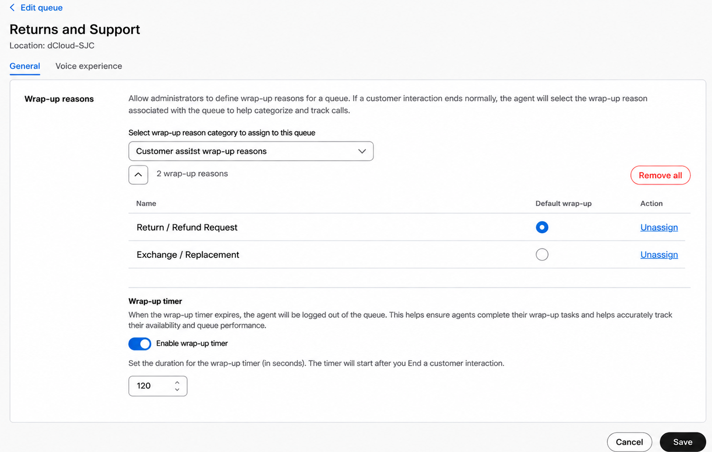

Congratulations, now the Returns and Support queue is completed, it’s time to move onto the AI receptionist.

