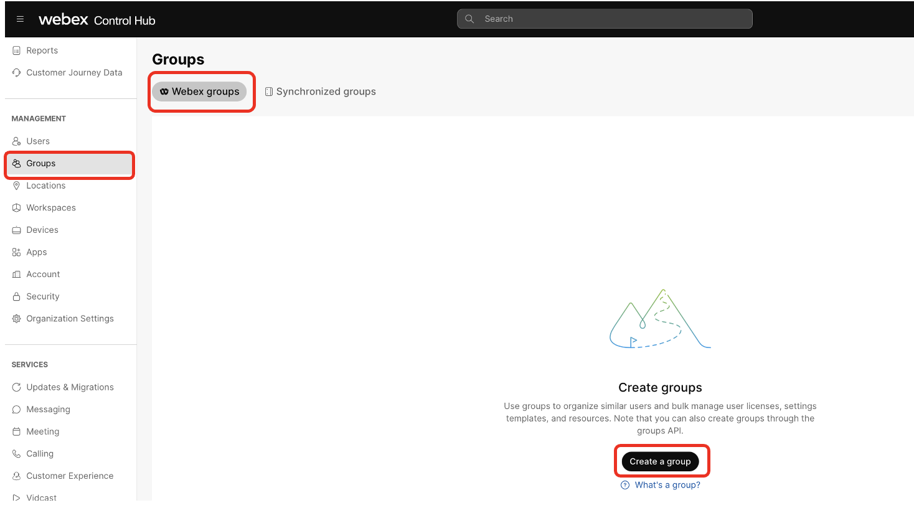
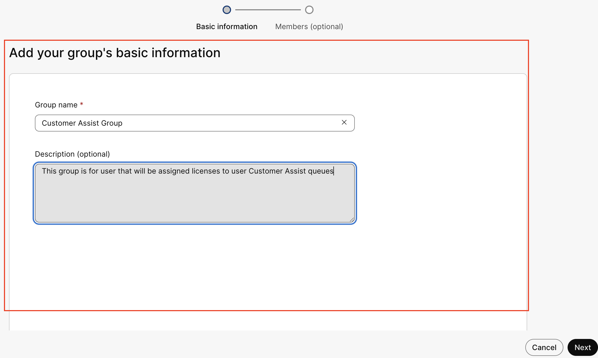
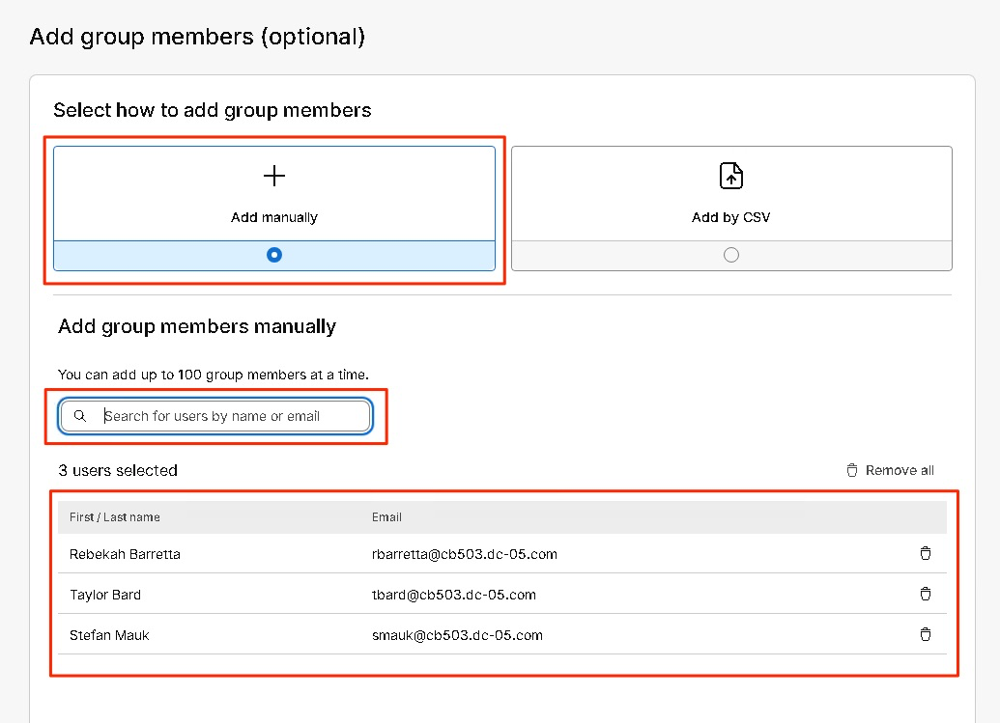
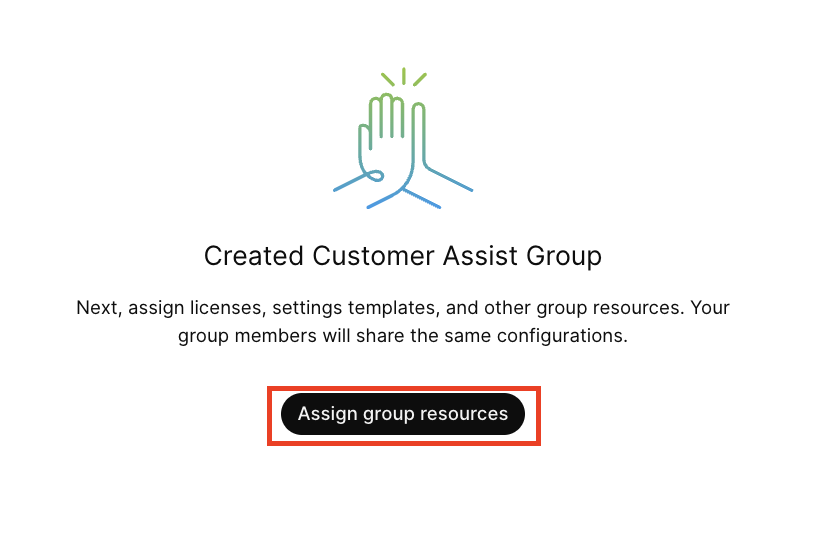
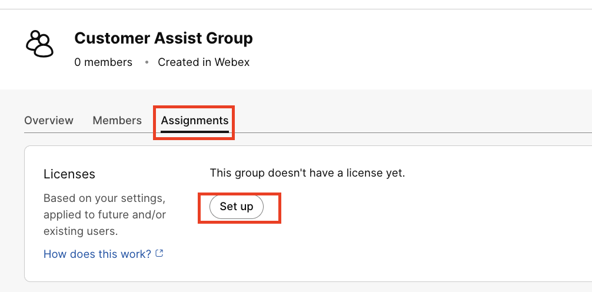
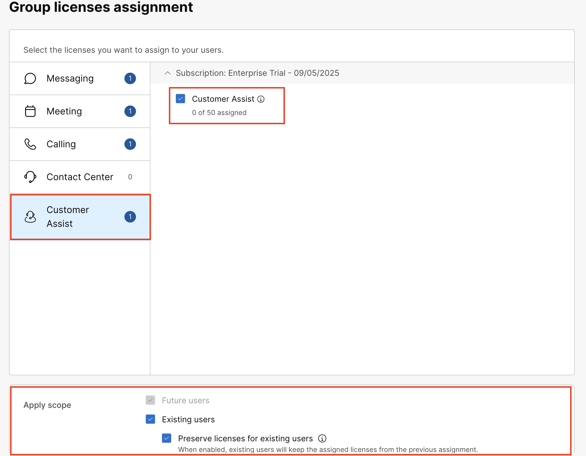

# Licensing users for Customer Assist

Licensing Users for Customer Assist

Users that will become agents or supervisors of Customer Assist queues will need to be licensed.  You can do this one at a time, using a Webex group or groups synchronized from your company directory. In this lab you will create a Webex Group

170. Under the management section of Control Hub, click Groups, then Webex groups then Create a group.

171. Enter the Group Name and then an (optional) description, press Next

172. Select Add manually and then search and add the following users and then click Save

• Rebekah Baretta

• Taylor Bard

• Stefan Mauk

173. Once complete, you will see an option to assign resources to the group, click Assign group resources

 

174. On the Assignment tab, Click on Set up

175. In the Group Licenses assignment window, click on the customer assist section and select the Customer Assist license.  Scroll down, in the Apply Scope section, select Existing user and Preserve licenses for existing users then click Save.

 

 

