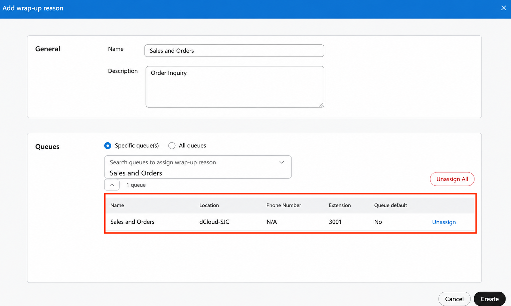
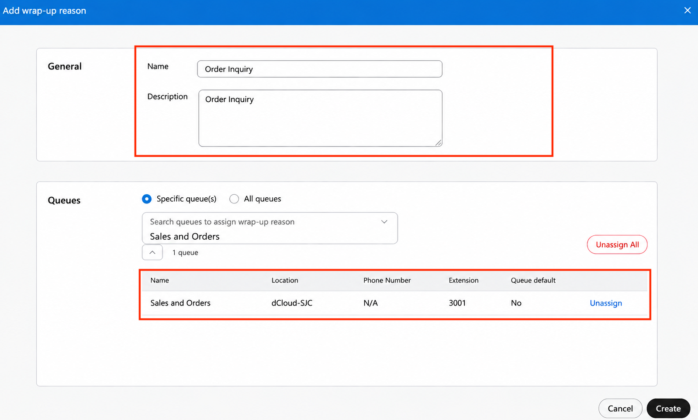
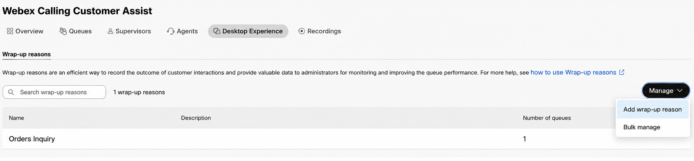
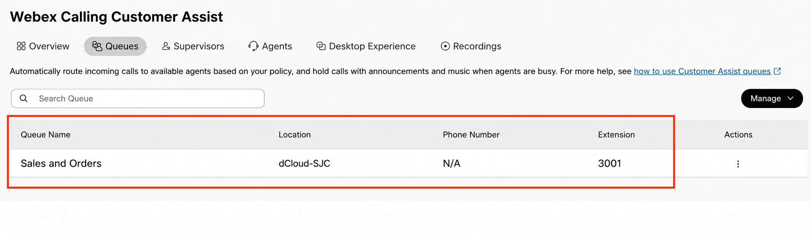
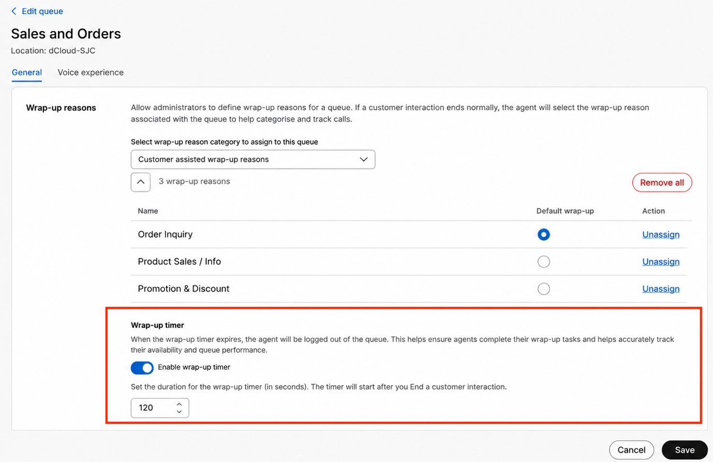

# Wrap-up reason and wrap-up timer for the Sales and Orders Queue

We will use the below Wrap-up reasons for the Agent(s) to select for the Sales and Orders queue

209. Go to Services &gt; Customer Assist &gt; Desktop Experience. Click on Add Wrap-up reason

210. On the Add wrap-up reason page, Create the Wrap up reason Order Inquiry then select Specific queue followed by the Sales and Orders Queue.  Click Create.

211. You will be taken back to the Wrap-up Reasons page.  Click Manage followed by Add Wrap-up Reason.

212. Add 2 more wrap up reasons, Product Sales / Info and Promotion &amp; Discount like how you added the first one

213. Next to Set a default wrap-up time for the support queue- Under the Services section on the left panel select Customer Assist &gt; Queues and select the Sales and Orders Queue as shown in the screenshot below

 71. Go to Overview section and click Wrap-up reasons.

73. From here you can see the assigned wrap-up reasons and the default option (in this example, Order Inquiry). Enable the Wrap-up timer and the timer to 120 (2 minute) and then click on Save.

Congratulations, now the Sales and Orders queue is completed, it’s time to move onto the Returns and Support queue.

