# Testing and Verification

You are now ready to test and experience the Webex Calling AI features.

For this section you will use two Webex apps to demonstrate and test the Agent and the Supervisor features.

134. Using Workstation1(wkst1), please open the Webex app. The Webex app is pre-installed, and you should be able to find the application in the Desktop. Double-click to open the Webex app. You will use the Webex app in Workstation1 for Agent Taylor Bard and Workstation2 for Supervisor Stefan Mauk.

135. In the Webex Login screen, click Sign in

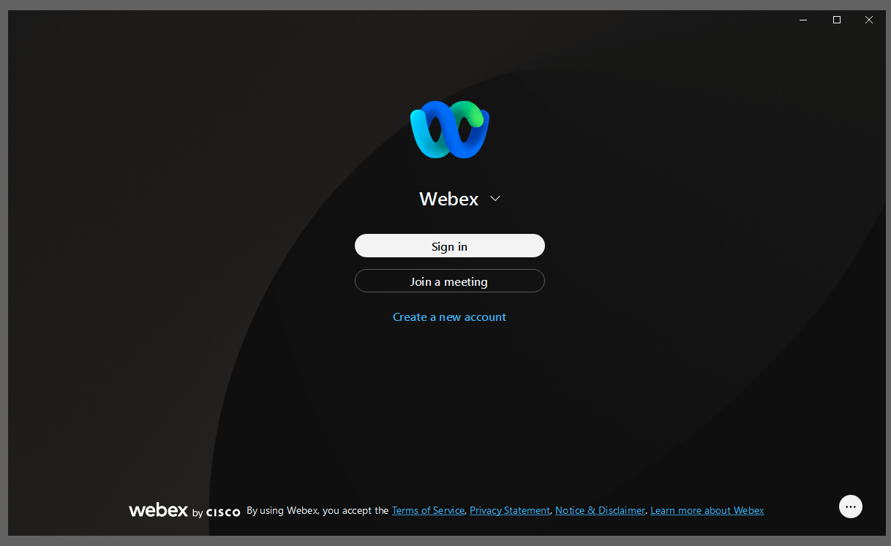

136. Enter Taylor Bard’s email address. The email will be tbard@cbXXX.dc-YY.com. Click Next.

137. Enter the password for Taylor, it should be in the dCloudZZZZ!.

138. Refer to the Getting started section to get the credentials. The domain and password are same for all the users (only the username changes).

139. If you see a Warning message about Webex app version needs to be updated, click “Close”.

140. Click “Ok” in the Emergency Calling Notification pop-up. (Please do not dial 911 from this Webex app)

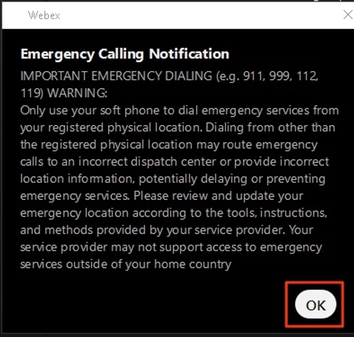

141. Click the “Customer Assist” icon in the left pane of the Webex app as shown below. You will then see the Customer Assist window of this user.

!!! note

    Note: Taylor is assigned as an Agent of the Appointment / Billing queue, so the Customer Assist Window you are seeing is the Agent screen.

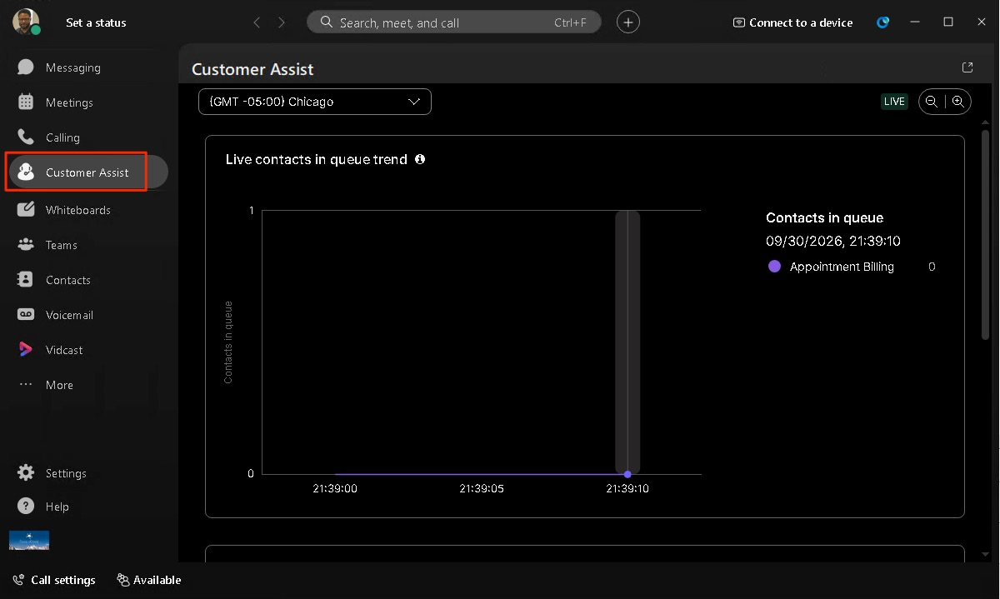

You can see the Agent state as ‘Available’ in the bottom of the Webex app, if you click the ‘Available’ option you can see Taylor is signed in to the Sales queue.

There are few options here for the Agent. First, Agent Status – if you click on the drop-down, you can see the different states that the Agent can choose. Available, Unavailable and Wrapping-up. Do not change the Agent state but go through/review the options the Agent has. Click Available after reviewing the options.

Available – The agent is ready to receive calls from queues.

Unavailable – The agent is not available to receive calls from queues.

Wrapping Up – The agent is in the Wrapping up state after a call and not available to receive new calls from the queue

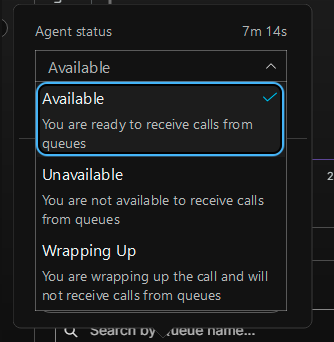

142. Go back to the dCloud Session detail page and click and on “Remote Desktop” for WKST2.

143. Open the Webex app in the Desktop of WKST2.

144. Click “Sign in” in the Webex app screen.

145. Stefan Mauk is the Supervisor for the Appointment / Billing queue you created. Enter the Email address of the user Stefan, it will be smauk@cbXXX.dc-YY.com, get the credentials from Getting Started section. The domain and password are same for all the users (only the username changes).

146. 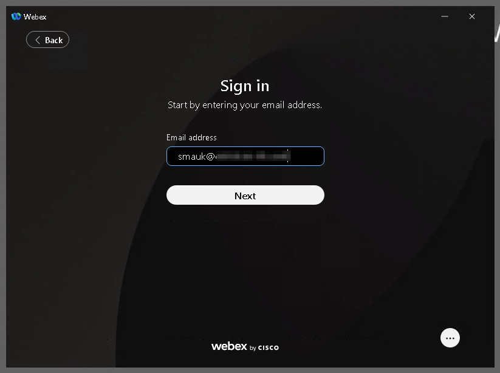

147. Enter the password for user Stefan. It is dCloudZZZZ!, where ZZZZ is the SessionID. (It is the same password that you used for the previous user Taylor). If you are still not sure, refer to the Getting started page for ZZZZ value then click Sign In.

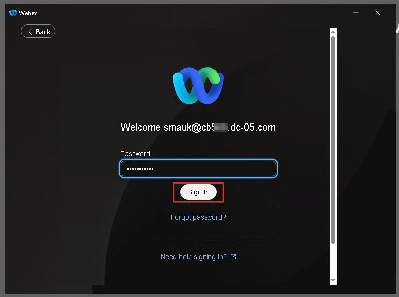

148. If you see a Warning message about Webex app version needs to be updated, click “Close”.

149. Click “Ok” in the Emergency Calling Notification pop-up. (Please do not dial 911 from this Webex app)

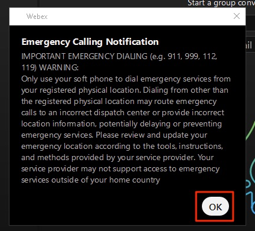

 

150. Click on the “Customer Assist” icon in the Webex app. Since Stefan is the Supervisor, he can see the Agents that are assigned to him. As the Supervisor, Stefan can see the agent’s (in this example, Taylor) current state and the duration of that state. 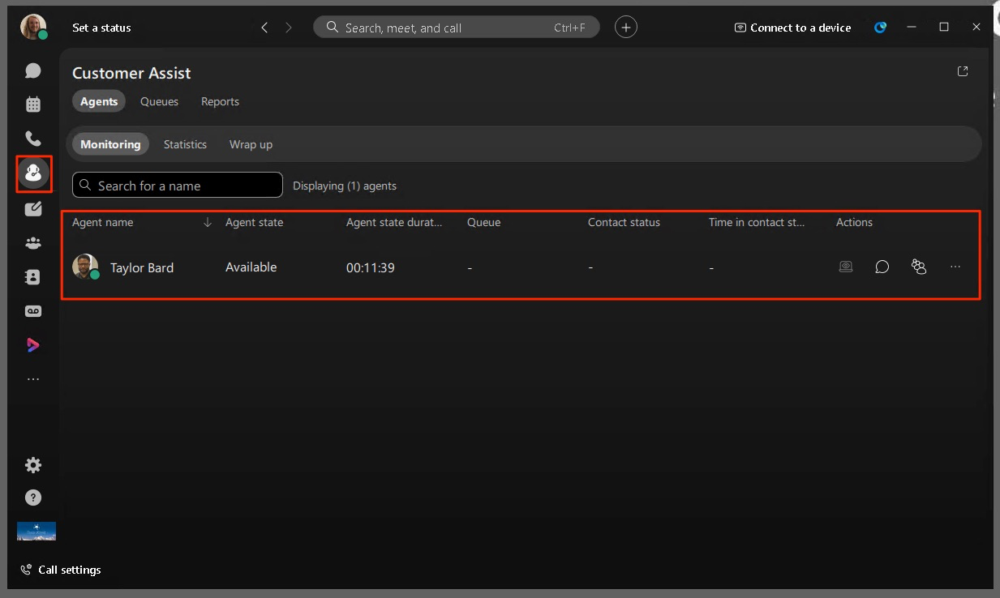

151. Go back to the dCloud Session detail page and click and on “Remote Desktop” for WKST3.

152. In Workstation3 (wkst3), please open the Webex app. The Webex app is pre-installed, and you should be able to find the application in the Desktop. Double-click to open the Webex app. We will sign in here as Rebekah Barretta, our Nurse agent.

153. In the Webex Login screen, click Sign in

154. Enter Rebekah Baretta’s email address. The email will be rbarretta@cbXXX.dc-YY.com. Click Next.

155. Enter the password for Rebekah, it should be in the dCloudZZZZ!.

156. Refer to the Getting started section to get the credentials. The domain and password are same for all the users (only the username changes).

157. If you see a Warning message about Webex app version needs to be updated, click “Close”.

158. Click “Ok” in the Emergency Calling Notification pop-up. (Please do not dial 911 from this Webex app)

159. Click the “Customer Assist” icon in the left pane of the Webex app as shown below. You will then see the Customer Assist window of this user.

!!! note

    Note: Rebekah is assigned as an Agent of the Nurse, so the Customer Assist Window you are seeing is the Agent screen.

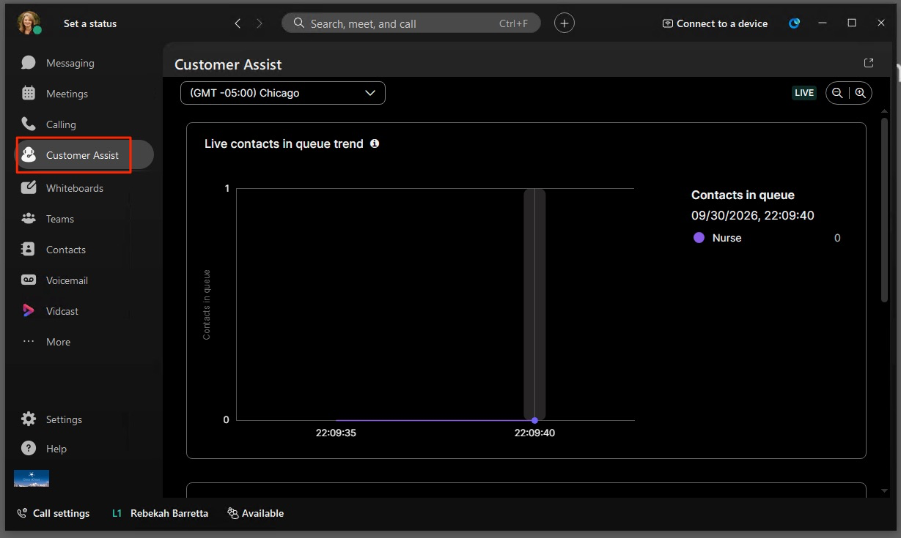

You can see the Agent state as ‘Available’ in the bottom of the Webex app, if you click the ‘Available’ option you can see Rebekah is signed in to the Nurse queue.

160. Navigate back to the Webex Control Hub in Workstation1. If the page is logged out, please use Charles’s credential to login to Webex Control Hub.

161. Once logged in, navigate to PSTN &amp; Routing under Services and click on Numbers tab. Make a note of the Phone number assigned to “AI Receptionist – Healthcare AI Receptionist” as shown below.

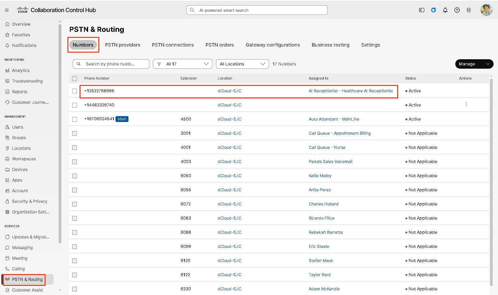

162. Make a call from your Cellphone to this “AI Receptionist – Healthcare AI Receptionist” number. You should hear the AI Receptionist answer the call and hear the AI Transparency message followed by the Welcome message.

163. Remember we had uploaded a Knowledge Base document to the AI Receptionist. Lets go ahead and ask some questions to make sure our AI Receptionist is able to lookup the document and answer our queries.

164. Ask question such as a). What insurances are accepted by the clinic? b). How do we setup appointments? C). What are the hours of the clinic? Make sure the AI Receptionist is able to answer the queries. You can cross-reference the Knowledge base to make sure you are getting the correct answers.

165. When you are ready, ask the AI Receptionist to transfer your call to someone so that you can make an appointment or you have a query on the billing you received.

166. The AI Receptionist will confirm your Transfer request and then will transfer your call to the Appointment / Billing queue.

167. Go to Workstation1 RDP and you will see Taylor’s Webex app ringing. Click Answer in the pop-up as shown below. 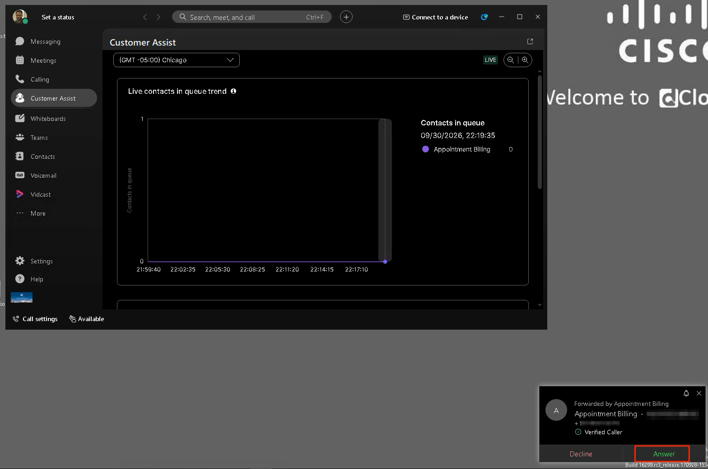

 

168. You will see the screen pop-up open in a web browser. We have setup a screen pop-up, when an agent answers the call – we are looking up the Caller’s number and showing up the result in the webpage.

169. You can minimize this window

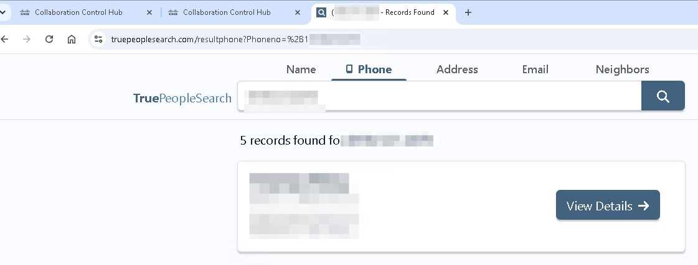

170. You will now see the Active Call Window with the queue name “Appointment Billing” and the Calling number (your cellphone number).

!!! note

    Note: If you see a popup saying Microphone was not found, click ok

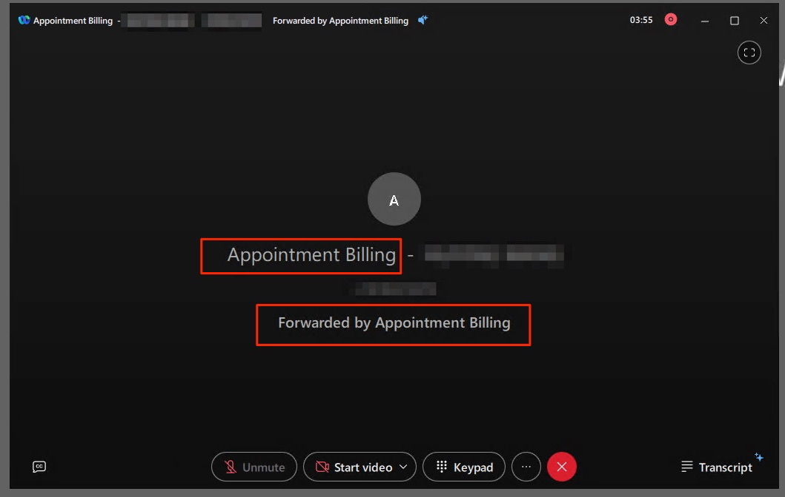

171. Now, look at other features for the Agent. You can leave the Call-in mute and in connected state. Click in the Webex app, Customer Assist and you can see the “Live Contacts in queue trend” – this shows the Agent how many calls are currently in the queue (you can see the 1 call you place listed, the value goes to 0 as you answer)

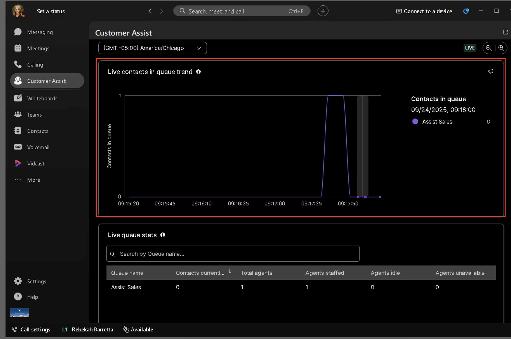

 

172. Now scroll down in the screen and you can see the “Live queue stats” section.

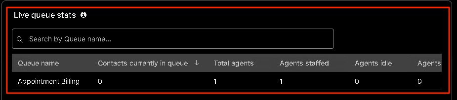

This section shows the List of Call queues that the Agent Taylor is part of and the Live Stats of these queues such as Total Agents, Agents Staffed, Agents idle and Agents unavailable.

There is also an option to Search/Filter by Queue name, when you click on the Search bar – you get an option to filter and look at the stats of a particular call queue.

Now you have explored the agent desktop, let’s look at what the Supervisor can see.

173. Please leave the call in connected state and move to Workstation2.

174. In Stefan’s Webex app, you should be able to see the following screen. This shows us some info about the Agents.

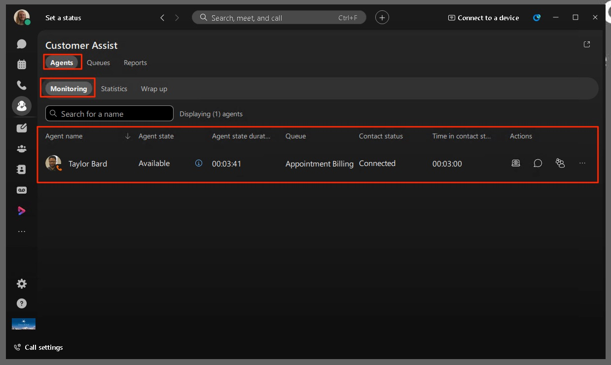

You can see Taylor’s Presence as “In a call”, his presence status shows “Connected” indicating he is in a call from the “Appointment Billing” queue and his Agent state is “Available”. This way, the Supervisor Stefan can see the list of his Agents and their live status.

175. You can also see, the supervisor Stefan has some Actions buttons. The one indicated in the picture below is to allow Stefan to send a quick message to Taylor using Webex messaging.

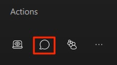

176. The next action button like shown below, this allows the Supervisor Join/Un-join the Agent from the queue by checking/un-checking the box 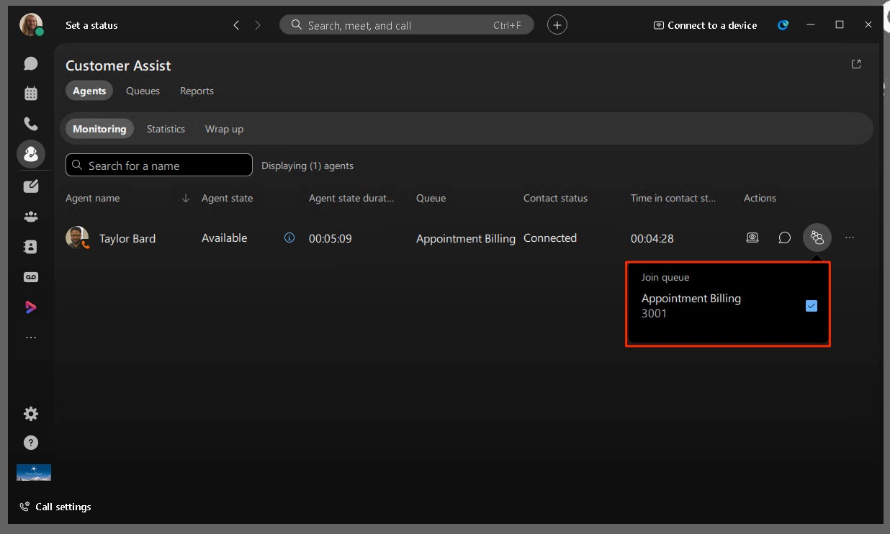

 

177. Click on the three dots (…), to see more options for the Supervisor. The Supervisor can change the Agent state to Available or Unavailable. And, if the Supervisor needs to, they can Sign out the Agent from the queue.

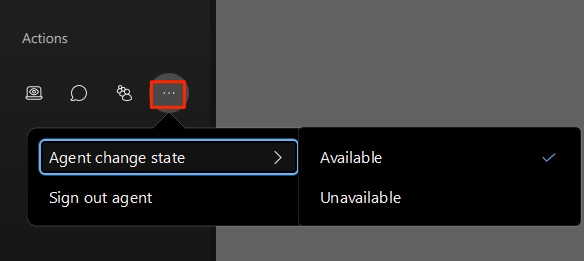

178. The first action button is the “Monitoring” action button. When you click this, the Supervisor can perform a Silent monitoring of the call between Agent and the End-customer.

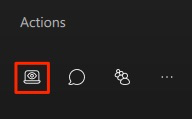

 

179. Now click the Monitoring button and you should see the following Call window in Ricardo’s machine.

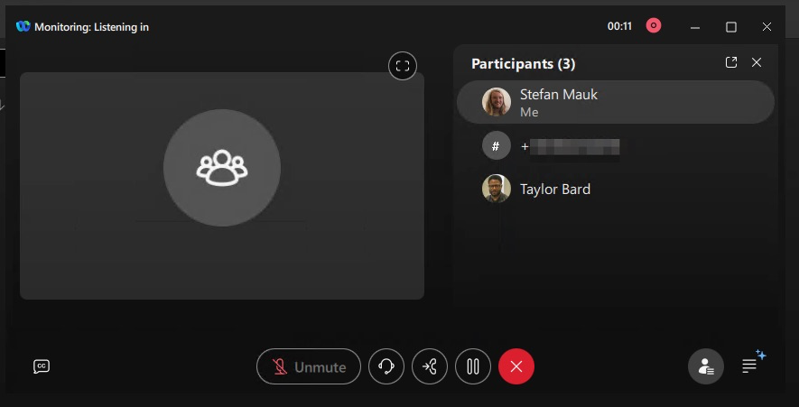

!!! note

    Note: The Supervisor can listen to the call between Agent and the End-customer. But the Agent and the End-customer are completely unaware of the Supervisor’s presence in the call.

180. In the above Monitoring window, you can see you have various call control options. The first one is “Whisper Coach”. If you click that, then the Supervisor can do whisper coaching to the Agent.

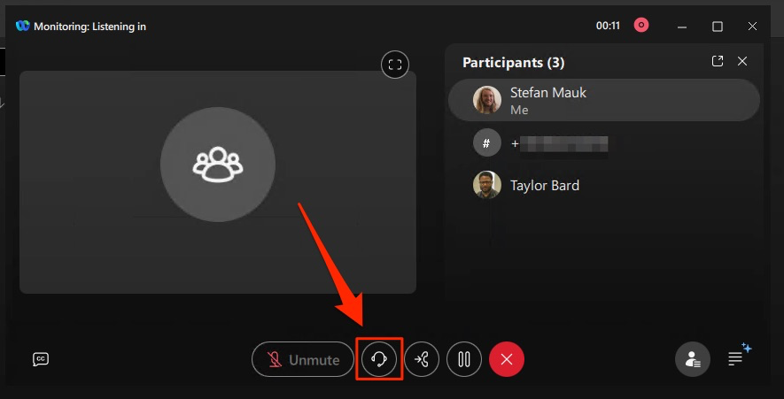

 

181. The next action button is Barge. This will allow the Supervisor to barge-in to the call between the Agent and the End-customer. This way, the Supervisor can speak with the Agent and the End-customer if needed.

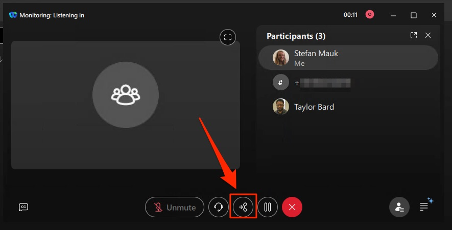

182. You can then click the “Transcript” icon and “Start Transcript” option to view the real time transcription, as you speak – you should be able to see the transcription adding up.

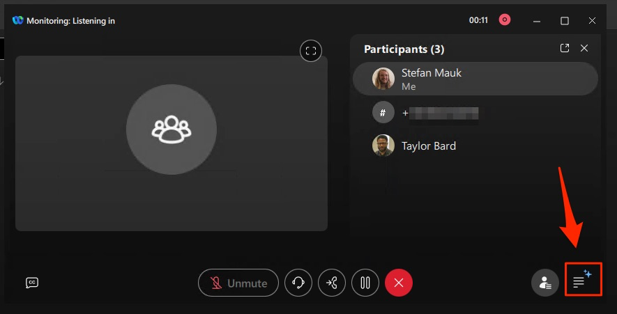

183. Hang up the call and you will be prompted to enter a Wrap up code.  Select a Wrap up reason from the list and click Submit Reason. These are the Wrap-up codes we have created for this queue.

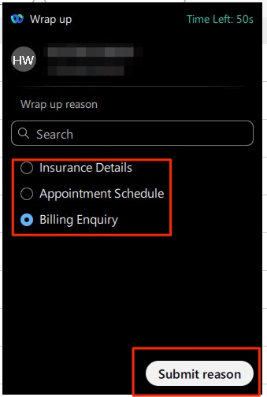

Similarly, if you would like you can call again to the AI Receptionist number and have the AI Receptionist transfer the call to the Nurse queue. Answer the call in Workstation3, in Rebekah’s Webex app.

 

184. Switch to Workstation 2 and under the Customer Assist tab you will see the queue activity in Stefan’s Webex app, you can see the queue activity based on Agents, Queues and Reports.

!!! note

    Note: The Screenshot you see in the lab might not be the same as below because you do not have enough data from the queue you just created – the screenshots below is a reference on how it would look in an actual customer environment

185. On the Agents tab, click Statistics. Supervisors can review the statistics of agents over a period. Look at what your supervisor is seeing with how you are interacting within this lab. This screen shows the stats including Connected counts, Average handle time, Average inbound connected time, Average inbound hold time (scroll down to see all the data).

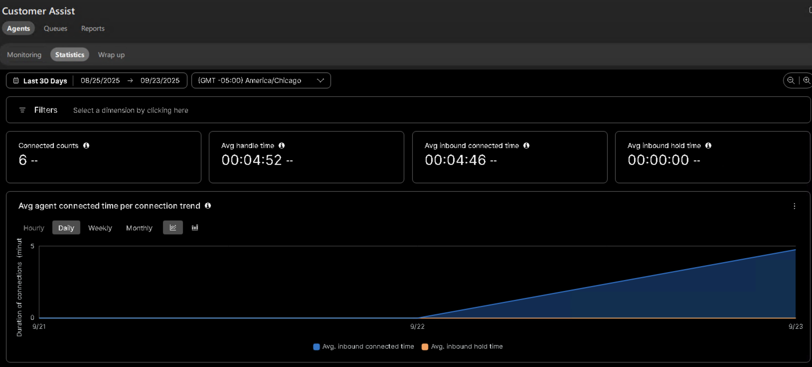

186. On the Agents tab, click Wrap up. Like statistics, the supervisors can see agent wrap up information, including Average wrap up duration and wrap up reason usage (scroll down to see all the data)

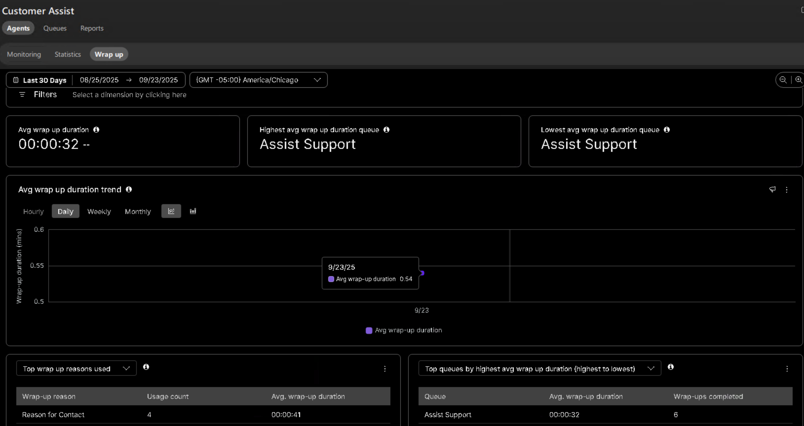

 

187. Next click on the Queues tab.  From here the supervisor can see real time and historical queue information.

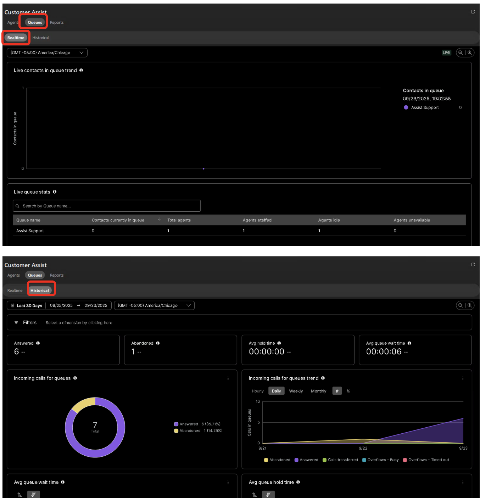

188. Notice in many of these cards, the supervisor has the option to click on the ellipses and download to a csv file.

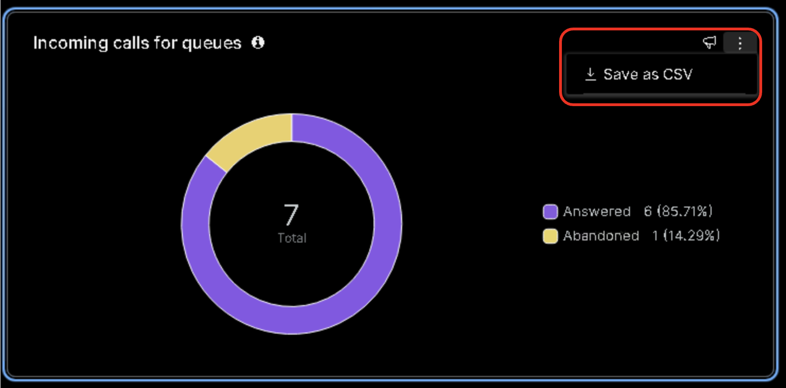

