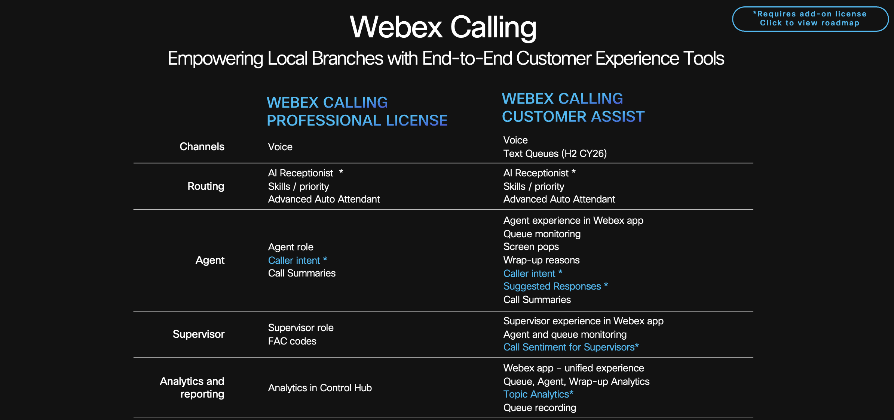

<!--
# 
Welcome!

<iframe src="https://app.sli.do/event/9FSNERWiqKg55MygtExCBX/questions" height="100%" width="100%" frameBorder="0" style="min-height: 560px;" allow="clipboard-write" title="Slido"></iframe>

-->

# Intelligent Interactions: Elevating Retail and Healthcare with Webex Calling AI

Amy Ryan - Principal Solutions Engineer, Collaboration

Ishan Sambhi - Solutions Engineer, Collaboration

Rajamani Nallakaruppan – Solutions Engineer, Collaboration

## About this lab

In this lab, you'll step into the role of a Webex Calling administrator for either a Healthcare company or a Retail company. You can choose which vertical you would like to perform this lab.

Your mission is to design and implement a Webex Calling AI Receptionist and a comprehensive Customer Assist call queue solution.

Lab Objectives:

• Configure AI Receptionist: You will build an AI Receptionist to front-face all the customer calls. We will feed a knowledge base document to the AI Receptionist, which can be looked upon by the AI Receptionist to answer caller/customer queries.

• Configure Core Call Queues: You will build two distinct Customer Assist call queues to meet organization needs:

• The customer-facing queues will be built using Webex Calling Customer Assist. This will provide advanced contact center capabilities such as queue management, screen pop, and detailed analytics.

• Verify and Experience the Solution: Once the queues are configured, you will have the opportunity to experience the agent and supervisor functionalities, verifying that the solution meets the requirements.

• Before you begin, let's start by understanding the key differences and capabilities of Webex Calling Call Queues and Webex Calling Customer Assist

 

