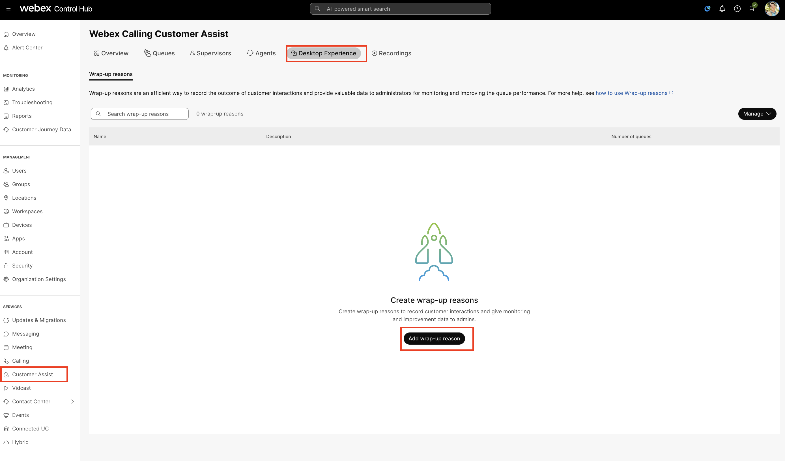
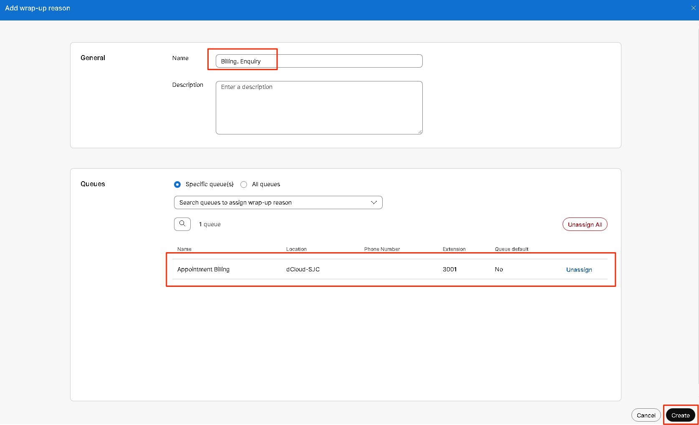
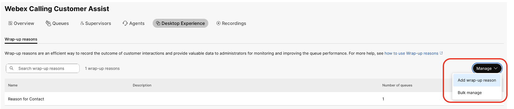
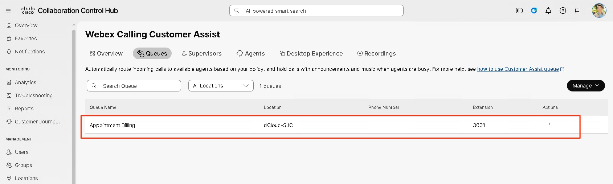
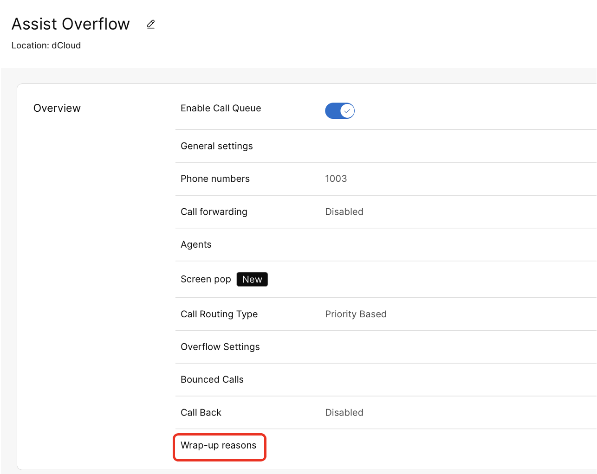
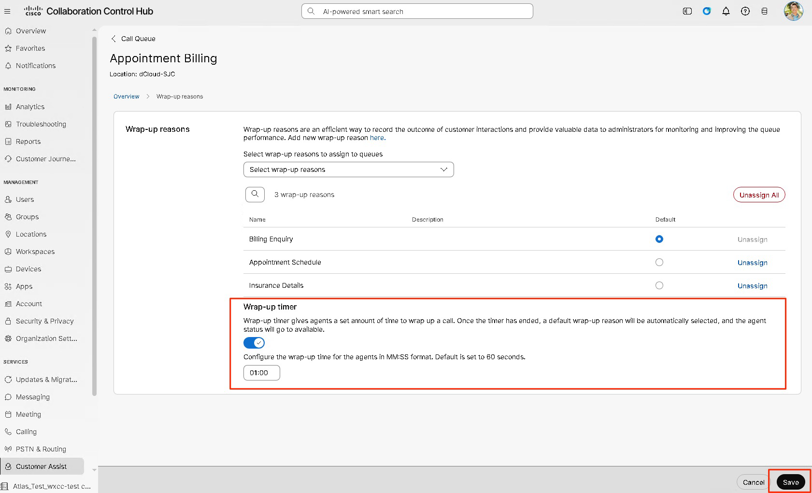

# Wrap-up reason and wrap-up timer for the Appointment / Billing Queue

We will use the below Wrap-up reasons for the Agent(s) to select for the Appointment / Billing queue

• Billing Enquiry

• Appointment Schedule

• Insurance details

57. Go to Services &gt; Customer Assist &gt; Desktop Experience. Click on Add Wrap-up reason

58. On the Add wrap-up reason page, Create the Wrap up reason Billing Enquiry then select Specific queue followed by the Appointment Billing Queue.  Click Create.

59. You will be taken back to the Wrap-up Reasons page.  Click Manage followed by Add Wrap-up Reason.

60. Add 2 more wrap up reasons, Appointment Schedule and Insurance details like how you added the first one

61. Next to Set a default wrap-up time for the support queue- Under the Services section on the left panel select Customer Assist &gt; Queues and select the Appointment Billing Queue as shown in the screenshot below

 71. Go to Overview section and click Wrap-up reasons.

72. From here you can see the assigned wrap-up reasons and the default option (in this example, Billing Enquiry). Enable the Wrap-up timer and the timer to 01:00 (1 minute) and then click on Save.

Congratulations, now the Appointment / Billing queue is completed, it’s time to move onto the Nurse queue.

